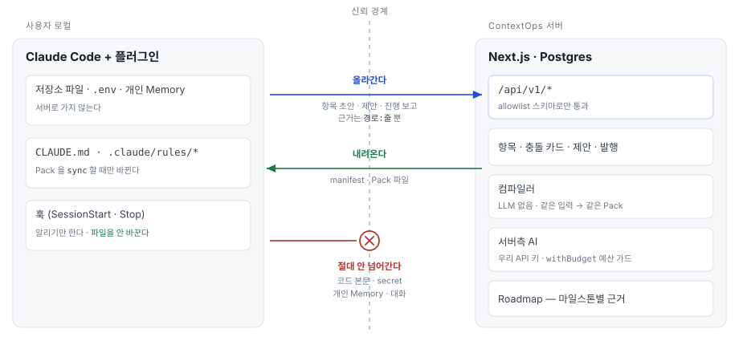
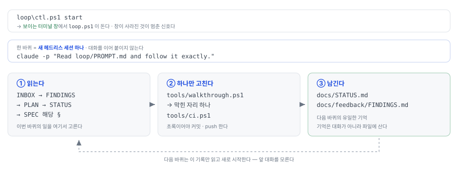

# ContextOps

**팀의 기억과 AI의 기억을 한 방향으로**

같은 팀인데 **AI마다 다른 답**을 합니다. 팀 규칙이 사람마다 다른 파일에 흩어져 있기 때문입니다.

ContextOps는 흩어진 규칙을 모아 **팀장이 승인한 하나로** 만들고, 그것을 **모든 팀원의 AI에
같은 내용으로** 넣어 줍니다. 그리고 계획이 실제로 어디까지 왔는지 **근거와 함께** 보여줍니다.

**팀장은 브라우저에서 15분, 개발자는 명령 한 줄.** 그게 전부입니다.

<sub>
<b>Wanted AI Championship 2026</b> 출품작 · 제출 2026-09-20 · 개발 1인 + Claude Code<br>
<a href="https://contextops-rosy.vercel.app/demo"><b>샘플 팀으로 둘러보기</b></a> (로그인 없이 · 매일 03:00 초기화) · 팀명 <b>퇴직했는데저좀이직시켜주세요</b> · <a href="https://github.com/rhdqngusanr/contextops">공개 저장소</a> (MIT) ·
지금 되는 것과 안 되는 것은 <a href="docs/KNOWN_LIMITATIONS.md">여기</a>에 정직하게 적었습니다<br>
<i>팀명·저장소 주소의 정본은 <code>apps/web/src/components/landing.tsx</code> 의 <code>SUBMISSION_IDENTITY</code> 하나이고, 이 README·제출서와 같은 글자인지 시험이 잽니다.</i>
</sub>

---

## 이런 일, 겪어보셨나요?

팀장이 회의에서 정합니다. **"결제가 실패하면 5번까지 다시 시도한다."**
문서에도 적었습니다. 그런데 두 달 뒤, 개발자가 AI에게 묻습니다.

> **"결제 실패하면 몇 번까지 다시 시도해?"**

**AI마다 답이 다릅니다.** 어떤 AI는 "5번"이라 하고, 어떤 AI는 "3번"이라 합니다.
누구는 문서를 읽었고, 누구는 코드를 읽었기 때문입니다. **그리고 문서와 코드가 어긋나 있었습니다.**

### 왜 이렇게 되나

AI 코딩 도구는 **팀 규칙이 적힌 파일**을 읽고 답합니다. 문제는 그 파일을 **개발자가 각자 자기 컴퓨터에서
따로 관리**한다는 겁니다. 마치 팀원마다 다른 판(版)의 사규를 들고 일하는 것과 같습니다.

- 팀장이 정한 목표와 규칙은 **AI에 안 들어갑니다** — 팀장은 개발자 도구를 안 쓰니까요
- 같은 팀인데 **팀원마다 AI가 다른 답**을 합니다
- 계획한 일이 **실제로 어디까지 왔는지 아무도 모릅니다**

---

## ContextOps 가 하는 일 — 세 걸음

<table>
<tr>
<td width="33%" valign="top">

### 1️⃣ 모읍니다

흩어진 문서·회의 결정·코드에서
<b>"팀이 지켜야 할 것"</b>을 뽑아냅니다.

서로 어긋나는 것이 있으면
**카드로 만들어 보여줍니다.**

</td>
<td width="33%" valign="top">

### 2️⃣ 사람이 정합니다

*"문서가 맞나요, 코드가 맞나요?"*

**AI는 묻기만 하고, 결정은 사람이** 합니다.
팀장이 승인한 것만 다음 단계로 갑니다.

</td>
<td width="33%" valign="top">

### 3️⃣ 모두에게 같은 것을

승인된 내용이 **모든 팀원의 AI에
같은 버전으로** 전달됩니다.

이제 누구에게 물어도 **같은 답**이 나옵니다.

</td>
</tr>
</table>

그리고 각자의 AI가 일을 마칠 때마다 **"이 작업이 어느 계획의 무엇이었는지"를 근거와 함께 보고**합니다.
그래서 계획이 실제로 어디까지 왔는지 보입니다.

<sub>같은 세 걸음을, 제품 화면이 쓰는 말 그대로 — <b>어떻게 동작하나요</b></sub>

| | |
|---|---|
| **가져와서 정리한다** | 목표 문서·회의록을 붙여 넣거나 질문 10개에 답하면, AI 가 규칙·마일스톤 후보를 뽑고 서로 어긋난 것을 찾아 질문으로 만듭니다. 결정은 사람이 합니다. |
| **승인해서 발행한다** | 팀장이 승인한 항목만 CLAUDE.md 한 벌로 묶여 버전이 붙습니다. 모든 팀원의 Claude Code 가 같은 버전을 받고, 받은 파일이 정말 같은지 확인표(해시)로 검증됩니다. 승인 뒤에는 AI 가 끼어들지 않습니다. |
| **진행이 근거와 함께 보인다** | 개발자의 AI 가 작업을 마치면 어떤 파일을 고쳤는지 보고합니다. 로드맵은 마일스톤 단위로 채워지고, 완료 판정은 사람이 합니다. |

<sub><b>snapshot</b> = 그 순간 승인돼 있던 항목 전체 · <b>Pack</b> = 그것을 AI가 읽는 파일로 구운 결과물 ·
<b>해시</b> = 내용이 같은지 한눈에 대조하는 지문. <b>재료가 같으면 결과도 언제나 같습니다.</b></sub>

---

## 실제로 이렇게 달라집니다

아래는 꾸며낸 예시가 아니라 **샘플 팀에서 실제로 나온 답**입니다.
누구나 [데모](#직접-보기)에서 그대로 확인할 수 있습니다.
개발자들이 실제로 쓰는 말이 그대로 나오므로, **칸마다 쉬운 말을 붙였습니다.**

> **질문 —** 결제사(PSP) 호출이 실패하면 몇 번까지 재시도해?
>
> <sub>쉬운 말로: *"결제가 실패하면 몇 번까지 다시 시도하나요?"*
> (PSP = 카드 결제를 대신 처리해 주는 외부 회사)</sub>

### 😵 전 — 각자의 AI

| 누가 물었나 | AI 의 답 | 무엇을 읽고 답했나 |
|---|---|---|
| **개발자 A** | 문서에는 최대 5회, 지수 백오프로 재시도하라고 되어 있습니다. 고정 간격은 금지입니다.<br><sub>쉬운 말로: 5번까지, 기다리는 시간을 점점 늘려 가며</sub> | `paylab-docs/goals.md §3.1`<br><sub>**팀 문서**를 읽었습니다</sub> |
| **개발자 B** | 코드에는 MAX_RETRY = 3, 간격은 500ms 고정으로 되어 있습니다.<br><sub>쉬운 말로: 3번까지, 0.5초 간격으로 똑같이</sub> | `paylab-api/src/payment/retry.ts:11`<br><sub>**실제 코드**를 읽었습니다</sub> |

**둘 다 거짓말을 한 게 아닙니다.** 문서와 코드가 어긋나 있었고, 각자 자기가 읽은 것을 답했을 뿐입니다.
A 는 문서를, B 는 코드를 읽었습니다. 둘 다 틀리지 않았는데 팀은 둘로 갈립니다. 같은 팀, 같은 질문, 다른 답 — 그리고 **어긋났다는 사실 자체를 아무도 몰랐습니다.**

### ✅ 후 — 팀이 승인한 것 하나

> PSP 호출은 최대 5회까지 재시도한다. 간격은 지수 백오프(0.5s·1s·2s·4s·8s)이고, 재시도 대상은 타임아웃과 5xx 뿐이다.
>
> <sub>쉬운 말로: **5번까지 다시 시도**하고, 기다리는 시간은 **0.5초 → 1초 → 2초 → 4초 → 8초**로 늘린다.
> 다시 시도하는 경우는 <b>응답이 안 올 때(타임아웃)</b>와 <b>상대 서버가 고장 났을 때(5xx)</b> 둘뿐이다.</sub>

이 한 줄에는 **항상 다음이 따라붙습니다.**

| | |
|---|---|
| **어디서 나왔나** | `paylab-docs/goals.md §3.1` · `paylab-api/src/payment/retry.ts:11–14` · 팀장 승인 |
| **얼마나 센 규칙인가** | must · 강제: 리뷰에서 본다 <sub>— 어기면 코드 리뷰에서 잡힙니다</sub> |
| **되짚어 갈 번호** | `<!-- ctx:item_policy_retry -->` <sub>— 이 꼬리표로 원문까지 한 번에 되짚습니다</sub> |

**핵심은 이 표입니다.** 답만 주는 게 아니라 <b>"어느 문서 몇 절, 어느 코드 몇 번째 줄에서 나왔고,
누가 승인했는지"</b>가 항상 붙어 다닙니다. 근거를 못 대는 줄은 **애초에 배포되지 않습니다**(원칙 P7).
팀장이 승인한 이 한 문장을 A·B·C 모두 같은 버전으로 받습니다. 그래서 이제 A·B·C 모두 같은 답을 합니다.

---

## 🔒 우리 서버가 보는 것 / 절대 못 보는 것

회사 코드를 남의 서버에 올리는 건 무서운 일입니다. **그래서 애초에 안 받게 만들었습니다.**

<picture>
  <source media="(prefers-color-scheme: dark)" srcset="docs/diagrams/trust-boundary-dark.svg">
  
</picture>

| ✓ 서버가 받는 것 | ✕ 서버가 **절대 못 받는** 것 |
|---|---|
| 팀·프로젝트 이름과 ID<br><sub>팀 이름과 프로젝트 이름</sub> | **저장소 코드 본문**<br><sub>소스 코드 그 자체</sub> |
| 정리된 항목 (제목·규칙·마일스톤)<br><sub>정리된 규칙 문장</sub> | **환경변수 · 비밀값(secret)**<br><sub>비밀번호·API 키 등 접속 정보</sub> |
| 팀장이 직접 등록한 문서 원문<br><sub>팀장이 손수 붙여 넣은 것만</sub> | 개인 설정 파일(CLAUDE.local.md)<br><sub>개인이 따로 쓰는 메모</sub> |
| 파일 경로 · 줄 번호 · 커밋 번호<br><sub>"몇 번째 줄"이라는 위치 표시만</sub> | Claude 의 개인 메모리(Auto Memory)<br><sub>AI 가 혼자 쌓아 둔 기억</sub> |
| 버전 · 확인표(해시)<br><sub>몇 판인지 · 내용이 같은지</sub> | Claude 대화 내용<br><sub>AI 와 주고받은 말 전부</sub> |

> **"안 보낸다"가 아니라 "받을 수 없다"입니다.** 서버가 받을 수 있는 항목 목록이 정해져 있고,
> 거기 없는 것은 **문 앞에서 거절**됩니다. 그리고 그게 지켜지는지 **컴퓨터가 매번 자동으로 검사**합니다 —
> 사람이 약속을 지키는 방식이 아닙니다.

<details>
<summary><b>개발자용 — 깨면 안 되는 원칙 7개와, 그걸 실제로 재는 검사</b> (펼치기)</summary>

<br>

[`tools/principles.ps1`](tools/principles.ps1) 이 매 커밋마다 **기계로 셉니다.**
문서에 적는 것만으로는 안 지켜지기 때문입니다.

| # | 원칙 | 무엇이 잰다 |
|---|---|---|
| **P1** | 서버는 저장소 **코드 본문·secret·개인 Memory·대화 transcript를 절대 받지 않습니다.** 업로드는 `.strict()` allowlist 스키마로만 통과 | 스키마 금지어 0건 · 관통이 진짜 소켓으로 나간 body 를 받아 코드 본문 0건·심은 env 값 0건을 잽니다 |
| **P2** | 제품 코드는 **사용자의 Claude를 대신 호출하지 않습니다.** Claude는 사용자가 Skill을 직접 실행할 때만 동작 | `claude -p`·Agent SDK 가 `plugin/`·`packages/`·`apps/` 에 0건 |
| **P3** | 서버측 LLM은 **우리 API 키**로만 · 4개 기능 한정 · 일일 예산·rate limit | 모든 호출이 `withBudget()` 경유 |
| **P4** | **승인 이후 파이프라인에는 LLM이 없습니다.** 같은 snapshot → byte-identical Pack | 컴파일러에 시각·난수·네트워크 0건 · golden 3종 · 항목 순서를 셔플해도 같은 byte |
| **P5** | 진행은 **마일스톤 단위만.** 개인 생산성 점수·순위를 만들지 않습니다 | 기계로 못 잽니다 — 눈 판정 항목 |
| **P6** | Hook은 **사용자의 파일을 변경하지 않습니다.** 변경은 사용자가 `/contextops:sync` 를 실행할 때만 | 훅이 쓰는 경로는 `hooks.json` 의 `_writes` 에 선언한 git-ignore 경로뿐 · 훅을 프로세스로 돌린 뒤 바이트 대조 |
| **P7** | 모든 Pack 줄은 항목 ID → 원문(문서 offset 또는 `path:line`)으로 **역추적**됩니다 | Pack 전 줄에 `<!-- ctx:… -->` 태그 · 태그 없는 줄이 하나라도 있으면 실패 |

전문은 [`docs/SPEC.md`](docs/SPEC.md) §0.1. **P1 의 근거 문서**는
[`docs/evidence/2026-09-06-p1-payload/p1-payload.md`](docs/evidence/2026-09-06-p1-payload/p1-payload.md) —
어떤 필드가 나갔고 어떤 필드가 **없는지**를 관통 산출물 그대로 적었습니다.

**올라가는 것**: 항목 초안 JSON · Proposal · Progress 이벤트(경로·줄·커밋) · sync 보고(버전·hash)
**내려오는 것**: manifest · Pack 파일

</details>

---

## 직접 보기

**설치도, 가입도 필요 없습니다.** <https://contextops-rosy.vercel.app/demo> 를 열면 샘플 팀 안으로 바로 들어갑니다.

| 무엇 | 어디서 보나 |
|---|---|
| 서로 어긋난 것을 AI가 찾아 **카드로 물어보는** 화면 — AI 제안 카드 3장은 2026-09-07 실측의 기록이고 카드가 그렇게 말합니다 | `정리` |
| 팀이 승인한 규칙 목록과 **버전 발행** | `Context` |
| 각 문장이 **어느 문서 몇 줄에서 왔는지** | `Pack Explorer` |
| 계획이 **어디까지 왔는지 · 근거는 무엇인지** | `Roadmap` |
| 팀원별로 **최신 버전을 받았는지** | `Sync` |

읽기 전용이고 매일 새벽 3시에 처음 상태로 돌아갑니다. 마음껏 눌러보셔도 됩니다.

> 랜딩 화면의 터미널 재생은 **꾸며낸 화면이 아닙니다.** 실제로 프로그램을 돌려 나온
> 출력을 그대로 녹화한 것입니다 (`fixtures/replay/sync.json`).

---

# 여기서부터는 개발자용입니다

<sub>위까지가 「무엇을 하는 물건인가」이고, 아래는 「어떻게 만들어졌나」입니다.</sub>

## 설치

Node 22 이상이 필요합니다 (node -v) — 훅과 CLI 가 Node 로 돕니다.

```
claude plugin marketplace add rhdqngusanr/contextops             # 플러그인 저장소를 등록합니다
claude plugin install contextops                                 # 자동으로 도는 작은 장치(훅) · Claude Code 안의 명령(Skill) · 실행 도구(CLI) 가 함께 깔립니다
/contextops:setup <Sync 화면이 준 인자>                           # Claude Code 안에서. 웹의 Sync → [기기 추가] 가 이 줄을 통째로 줍니다 — 토큰은 저장소 밖에 둡니다
/contextops:init                                                 # Claude Code 안에서 한 번. 저장소를 훑어 첫 항목을 올립니다
```

그 다음은 팀장이 웹에서 승인하고, 개발자는 /contextops:sync 로 받습니다.

`setup` 이 남기는 것은 둘뿐입니다 — `<repo>/.contextops/project.json`(커밋 · secret 없음) 과
`~/.contextops/credentials.json`(0600 · 저장소 밖). 토큰은 웹에서 발급해 붙여 넣습니다.

| CLI | 하는 일 |
|---|---|
| `scan` | 저장소를 결정론으로 훑어 `.contextops/cache/scan.json` 을 만든다 — 경로·언어·env **키 이름**만. 본문 없음 |
| `validate <json>` | 초안·제안 JSON 이 계약과 맞는지 네트워크 없이 판다 (번들에 같은 Zod 가 들어 있다) |
| `upload-draft` | 초안을 올린다. `--dry-run` 이면 보낼 payload 를 그대로 보여 주고 보내지 않는다 |
| `status` | 무엇이 적용돼 있나 — applied / outdated / modified. 파일을 안 바꾼다 |
| `sync` | 발행된 Pack 을 적용한다 — backup → atomic rename → 적용 뒤 hash 재검증 → 실패하면 전부 복원 |
| `propose` | 변경 제안을 공식 버전 기준으로 올린다 (근거는 `path:line`) |
| `progress` | 마일스톤 진행을 보고한다 — 근거는 경로와 줄 번호뿐 |

Skill 다섯(`/contextops:init` · `sync` · `propose` · `setup` · `progress`)과 훅 둘(`SessionStart` · `Stop`)은
[`plugin/contextops`](plugin/contextops) 에 있습니다. `setup`·`progress` 는 CLI 의 경로를 사용자 대신 채워 주는 문입니다
(플러그인 번들의 경로는 사용자 터미널에 없습니다). `SessionStart` 훅은 새 버전이 있으면 **알리기만** 하고,
`Stop` 훅은 바뀐 경로만으로 진행 이벤트를 보고합니다 — 둘 다 LLM 을 부르지 않습니다.

---

## 로컬에서 돌리기

계정이 없어도 전부 돕니다 — DB 는 프로세스 안의 PGlite 입니다. 서버측 AI(문서 구조화·충돌 탐지)만 `GEMINI_API_KEY` 가
필요하고, 키가 없으면 그 job 은 `AI_NOT_CONFIGURED` 로 끝나며 화면이 그 사실을 말합니다 — 나머지(항목·발행·Pack·sync·데모)는
키 없이 전부 됩니다.

```
pnpm install
pnpm --filter web demo:db      # PGlite + paylab 씨앗 + 게스트 데모. DATABASE_URL 등을 찍어 준다
pnpm --filter web dev          # 위가 찍은 값을 환경변수로 주고 띄운다 → http://localhost:3000/demo
```

배포에 필요한 환경변수의 정본은 [`apps/web/.env.example`](apps/web/.env.example) 입니다 (값은 적지 않습니다 — P1).

### 검사

```
powershell -ExecutionPolicy Bypass -File tools/ci.ps1          # 전 층 검사 → .ci/result 한 줄
powershell -ExecutionPolicy Bypass -File tools/principles.ps1  # 원칙만 (빠름)
powershell -ExecutionPolicy Bypass -File tools/walkthrough.ps1 # 관통 시나리오
```

| 층 | 무엇을 보장하나 |
|---|---|
| `principles` | P1·P2·P3·P4·P6·P7 을 기계로 센다 |
| `typecheck` · `test` | 전 패키지 `tsc` · vitest (schema · compiler golden · api · plugin CLI · 화면을 그려서 읽는 시험) |
| `build` | `next build` |
| `walkthrough` | 픽스처 → 항목 → 발행 → Pack → 배포되는 번들이 진짜 소켓으로 `scan → upload → sync → applied` 까지 **실제로 지난다.** 9단계 (마지막 둘은 헤드리스 Chrome 캡처와 그 캡처를 랜딩으로 옮기기) |
| `docs` | 루프 문서가 자기와 어긋나지 않는가 |

「테스트 초록」은 완성이 아닙니다. **관통이 지나야** 「된다」이고, 화면은 캡처를 눈으로 보고 판정합니다.

---

## 저장소 지도

| 경로 | 무엇 |
|---|---|
| `packages/schema/` | Zod 계약의 정본 — ItemType 10종 · SourceRef 4종 · 업로드 allowlist · Manifest. 모든 곳이 여기서 import 한다 |
| `packages/compiler/` | 결정론 컴파일러 — partition · sort · render · 역추적 태그 · hash. 순수 함수만 |
| `packages/compiler/templates/` | 버전 고정 템플릿 (`CLAUDE.md` · `.claude/rules/*` · `AGENTS.md` · `.cursor/rules/*.mdc`) |
| `packages/compiler/test/golden/` | 같은 snapshot → 같은 byte 를 잠그는 golden 3종 (P4) |
| `apps/web/src/app/` | Next.js 15 App Router — 화면 9개 + `/t` 내 팀 홈 + `/privacy` + `/demo` |
| `apps/web/src/app/api/v1/` | Route Handlers — 모든 외부 입력은 `packages/schema` 로 판다 |
| `apps/web/src/db/` | Drizzle 스키마·마이그레이션 (표 18 · enum 17 · 전 표 RLS) |
| `apps/web/src/lib/api/` | 인증 · 권한 · 에러 코드 · 요청 로그(필드 표 하나) · Cron 자물쇠 |
| `apps/web/src/lib/ai/` | 서버측 AI — `withBudget()` · 기능 4종 표 · 문서 구조화 · 충돌 탐지 |
| `apps/web/src/lib/demo/` | 데모 테넌트 — 시드 · 리셋 · 지우기 (제품 코드다 · Cron 이 부른다) |
| `apps/web/src/components/` | 화면 컴포넌트 — 문구는 표에, JSX 는 표를 읽기만 |
| `apps/web/scripts/` | 개발용 씨앗 서버 · 화면 덤프 · 관통 단계 스크립트 (제품에 안 들어간다) |
| `apps/web/vercel.json` | Cron 둘 — health 하루 1회 · 데모 리셋 매일 · 함수 리전 서울 (한도의 정본은 `apps/web/src/lib/api/vercel.ts`) |
| `plugin/contextops/` | Claude Code 플러그인 — `skills/` 5 · `hooks/hooks.json` · `scripts/` 훅 2 · `bin/contextops-cli.mjs` 단일 번들 |
| `plugin/contextops/src/cli/` | CLI 소스 — 명령 표 하나(`commands.ts`) · exit 코드 표 하나 |
| `plugin/contextops/schemas/` | `packages/schema` 에서 낸 JSON Schema (로컬 검증용) |
| `fixtures/paylab-api/` | 샘플 저장소 (TS 48파일 · 의도된 어긋남 3곳) — 값이 든 secret 은 0건 |
| `fixtures/paylab-docs/` | 팀장 문서 + 폐기 로드맵 1개 |
| `fixtures/replay/` | 랜딩 터미널 재생 녹화 — 관통이 매번 다시 녹화해 대조한다 |
| `fixtures/seed/` | 데모 테넌트 시드 |
| `tools/ci.ps1` | 전 층 검사 |
| `tools/principles.ps1` | P1~P7 기계 검사 |
| `tools/walkthrough.ps1` | 관통 시나리오 9단계 |
| `tools/fixtures.mjs` | 픽스처가 조용히 상하지 않았나 (관통 첫 단계) |
| `tools/status-shape.mjs` | 루프 문서가 자기와 어긋나지 않나 |
| `loop/` | 🔁 자율 개발 루프 — 이 저장소를 만드는 도구 |
| `docs/SPEC.md` | 정본 명세 — 무엇을 만들 것인가 |
| `docs/DESIGN_BRIEF.md` | 화면 토큰·컴포넌트 정본 |
| `docs/PLAN.md` | Phase 체크리스트 — 루프가 여기서 일을 고른다 |
| `docs/STATUS.md` | 지금 어디인가 (= 다음 바퀴의 기억) |
| `docs/feedback/INBOX.md` | 사람 → 루프. 최우선 |
| `docs/feedback/FINDINGS.md` | 관통이 찾아 놓은 대장 — 고장·구멍·격차 |
| `docs/evidence/` | 바퀴마다 남긴 근거 — 캡처 · 덤프 · 관통 산출물 복사본 |
| `docs/history/` | STATUS 에서 내려온 지난 바퀴 기록 |
| `docs/KNOWN_LIMITATIONS.md` | 알려진 한계 — 지금 안 되는 것 |
| `docs/SUBMISSION.md` | 제출서 원문 — 랜딩·README 와 같은 문장인지 시험이 잰다 · 🙋 자리(production URL · 영상 · 슬라이드) |
| `CLAUDE.md` | 저장소 개발 규칙 — 사람과 AI 세션이 같이 지킨다 |
| `LICENSE` | MIT |

의존 방향은 한쪽입니다: `schema ← compiler ← web / plugin`. 패키지는 `index.ts` 하나로만 내보냅니다.

### 기술 스택

TypeScript 5 / Node 22 · pnpm workspace · Next.js 15 (App Router · Route Handlers) · Postgres (Supabase) + Drizzle ORM ·
PGlite (시험·로컬) · Zod · vitest · Vercel (Cron 포함)

서버측 AI: Gemini `generateContent` — SDK 없이 `fetch` (`responseJsonSchema` 구조화 출력 · `withBudget()` 필수)
플러그인: Claude Code 공식 plugin 레이아웃 · esbuild 단일 ESM 번들 (런타임 의존 0)

### AI 는 어디에 · 얼마나

AI 는 **사람이 결정하기 전** 단계에만 있습니다 — 서버쪽 둘(문서 구조화 · 충돌 탐지 · 우리 Gemini 키)과 팀원 본인의 Claude Code(플러그인).
승인 이후의 컴파일·배포에는 모델이 없습니다 (P4). 같은 두 픽스처 문서를 제품 그대로의 길로 굴린 실측입니다 —
숫자는 근거 JSON 에서 다시 계산해 시험이 대조합니다 (`apps/web/test/readme.test.ts`).

| 잰 것 | 값 |
|---|---|
| 입력 | goals.md 3,513자 + old-roadmap.md 707자 (문서 둘) |
| 항목 후보 | 22 (goals 16 · roadmap 6) · 열린 질문 4 |
| 충돌 카드 | 5 (전부 contradiction · 판정 없이 질문으로) |
| 인용 일치 | 26/26 (모델이 낸 인용을 서버가 원문에서 찾았다) |
| 시간 | 약 29초 (구조화 둘 + 충돌 탐지) |
| 토큰 | 입력 5,921 · 출력 8,286 |
| 비용(정가) | 약 $0.08 (gemini-3.5-flash · 입력 1.50 · 출력 9.00 USD/M) |
| 출처 | `docs/evidence/2026-09-07-p3-gemini/probe-87-run3.json` (2026-09-07 · 진짜 API · 같은 코드로 세 번 중 셋째) |

왜 서버쪽이 Gemini 인지, 도구 세 층, 지속 계획은 [`docs/SUBMISSION.md`](docs/SUBMISSION.md) 「AI 활용」에 있습니다.

---

## 🔁 이 저장소는 자율 루프가 만듭니다

개발 자체가 **루프 엔지니어링**으로 돌아갑니다. 한 바퀴마다 새 헤드리스 Claude Code
세션이 열려서, 문서에서 이번에 뭘 할지 읽고, **하나만** 고치고, 검사하고, 커밋하고,
다음 바퀴를 위한 기록을 남깁니다.

<picture>
  <source media="(prefers-color-scheme: dark)" srcset="docs/diagrams/loop-cycle-dark.svg">
  
</picture>

**대화를 이어 붙이지 않습니다. 기억은 파일에 삽니다.** 이 루프는 `claude -p` 로 돌지만
P2 위반이 아닙니다 — `loop/`·`tools/` 는 배포되는 제품이 아니라 우리 자신의 구독으로 이 저장소를 만드는 개발 도구입니다.

자세히: [`loop/README.md`](loop/README.md) · 한 바퀴의 전부: [`loop/PROMPT.md`](loop/PROMPT.md)

```bash
powershell -ExecutionPolicy Bypass -File loop/ctl.ps1 install
powershell -ExecutionPolicy Bypass -File loop/ctl.ps1 dryrun   # 안전 — 아무것도 안 고침
powershell -ExecutionPolicy Bypass -File loop/ctl.ps1 start
```

---

## 기여

기여하기 전에 [`CLAUDE.md`](CLAUDE.md) 를 읽어 주세요 — 사람과 AI 세션이 함께 지키는 저장소 규칙입니다.
특히 **P1~P7 을 어기는 PR 은 받지 않습니다.** 확장은 「표에 한 줄」이어야 합니다 — 타입·명령·기능을 더하는 절차는
그 표 옆 주석에 적혀 있습니다.

**알려진 한계**는 [`docs/KNOWN_LIMITATIONS.md`](docs/KNOWN_LIMITATIONS.md) 에 정직하게 적습니다.

## 라이선스

MIT — [`LICENSE`](LICENSE)
