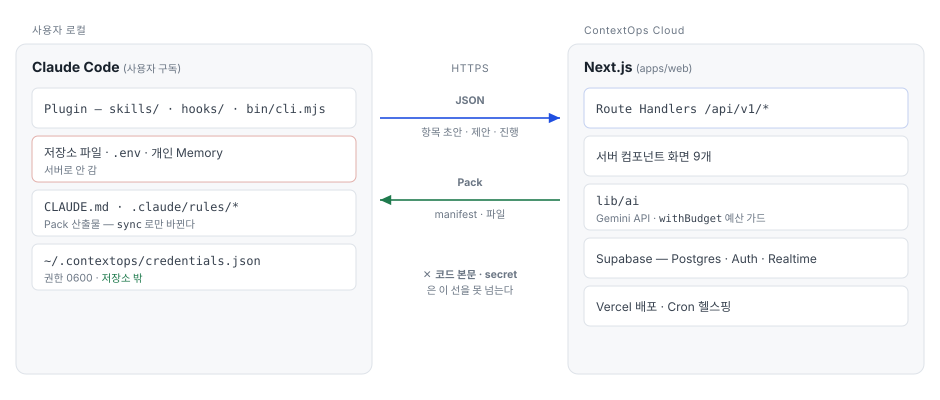

# ContextOps — 상세 구현 명세서 v2.0 (해커톤용)

> 대상: Claude Code(구현) · 사용 방법: 이 문서를 저장소 루트의 `docs/SPEC.md`로 두고, CLAUDE.md에 "구현 전 docs/SPEC.md의 해당 섹션을 읽고, 완료 기준을 만족한 뒤 다음 Phase로 간다"를 명시한다. 각 Phase는 독립적으로 검증 가능하다.
> 대회: Wanted AI Championship 2026 · 제출 마감 2026-09-20 · 심사 2026-09-21~10-05 · 개발 1인 + Claude Code · 기간 18일

---

## 0. 제품 정의와 절대 원칙

**한 줄:** 팀의 목표·로드맵·기술 결정을 하나의 승인된 AI Context로 만들어 모든 팀원의 Claude Code에 같은 버전으로 배포하고, 로드맵이 실제로 진행되는지를 근거와 함께 보여준다.

**슬로건:** 팀의 지식과 Claude의 기억을 같은 방향으로.

### 0.1 절대 원칙 (코드 리뷰 시 위반 여부를 검사한다)

| # | 원칙 | 검사 방법 |
|---|---|---|
| P1 | 서버는 저장소 코드 본문·secret·개인 Memory·대화 transcript를 절대 받지 않는다. 업로드 payload는 allowlist 스키마로만 통과한다. | `packages/schema`의 upload 스키마에 `content`류 필드가 없음. 통합 테스트 `security/payload.test.ts` |
| P2 | 우리 코드는 사용자의 Claude를 절대 대신 호출하지 않는다. `claude -p`, Agent SDK, 구독 OAuth 재사용 금지. Claude는 사용자가 Skill을 직접 실행할 때만 동작한다. | grep `claude -p`, `@anthropic-ai/claude-agent-sdk` → plugin·cli에 0건 |
| P3 | 서버측 LLM은 API 키(종량제)로만, 4개 기능에 한정, 일일 예산·rate limit·입력 크기 상한이 있다. | `apps/web/src/lib/ai/budget.ts` 존재, 모든 AI 호출이 `withBudget()` 경유 |
| P4 | 승인 이후 파이프라인(컴파일·해시·배포)에는 LLM이 없다. 같은 snapshot → byte-identical Pack. | `packages/compiler` golden test |
| P5 | 진행 상태는 마일스톤 단위로만 표시한다. 개인별 생산성 점수·순위를 만들지 않는다. | Roadmap 화면에 사람 이름이 기본 행으로 나오지 않음 |
| P6 | Hook은 **사용자의 파일**을 변경하지 않는다. 저장소에서 훅이 쓸 수 있는 자리는 `.contextops/` 안의 **git이 무시하는 경로**(`IGNORED_LOCAL_PATHS`)뿐이고, 훅마다 `hooks/hooks.json`의 `_writes` 표에 **선언한** 경로로 한정된다. 관리 파일(`CLAUDE.md`·`.claude/rules/*`) 변경은 사용자가 `/contextops:sync`를 실행할 때만. | `tools/principles.ps1`: hooks.json이 가리키는 스크립트에 fs write가 있으면 `_writes`에 선언돼 있어야 하고, 선언된 경로는 전부 ignore 목록 안이어야 한다 · `test/hooks.test.ts`: 훅을 **프로세스로 돌린 뒤** 바뀐 경로가 선언한 것뿐이고 나머지는 바이트·mtime이 그대로 |
| P7 | 모든 Pack 줄은 항목 ID → 원문(문서 offset 또는 코드 path:line)으로 역추적된다. | source map 테스트 |

### 0.2 용어

- **Context Item(항목):** 팀 공식 지식의 최소 단위. 10개 타입 중 하나. DB에 저장되는 정본.
- **Team Context / Wiki:** 프로젝트의 active 항목 집합. "Wiki 폴더"는 존재하지 않으며 컴파일 산출물이 폴더처럼 보일 뿐이다.
- **Pack:** 특정 버전의 컴파일 산출물(CLAUDE.md, .claude/rules/*.md, AGENTS.md, .cursor/rules/*.mdc, .contextops/manifest.json).
- **Proposal:** 항목 추가·수정·폐기 제안. 승인되어야 다음 버전에 포함.
- **Progress 이벤트:** 로드맵 마일스톤에 대한 진행 근거 보고. 자동 전송. 코드 본문 없음.
- **Conflict 카드:** AI가 찾은 상충·오래됨·병합 후보. 사람이 클릭으로 결정.

---

## 1. 아키텍처

<picture>
  <source media="(prefers-color-scheme: dark)" srcset="diagrams/architecture-dark.svg">
  
</picture>

<sub>올라가는 것: Context Item 초안 JSON · Proposal · Progress 이벤트 · sync 보고(버전·hash) ·
내려오는 것: manifest · Pack 파일</sub>


### 1.1 저장소 구조 (pnpm workspace, Turborepo 없음)

```
contextops/
├── package.json                 # workspaces: apps/*, packages/*, plugin
├── pnpm-workspace.yaml
├── tsconfig.base.json
├── .github/workflows/ci.yml     # lint · test · plugin validate
├── apps/
│   └── web/                     # Next.js 15 App Router (프론트 + API)
│       ├── src/app/(marketing)/page.tsx          # 랜딩
│       ├── src/app/(app)/t/[team]/p/[project]/…  # 앱 화면
│       ├── src/app/api/v1/…                      # Route Handlers
│       ├── src/db/schema.ts                      # Drizzle
│       ├── src/db/migrations/
│       ├── src/lib/ai/{client,budget,prompts}/   # 서버측 AI
│       ├── src/lib/auth.ts                       # Supabase Auth · 토큰 검증
│       └── src/lib/compiler-runner.ts            # packages/compiler 호출 + 저장
├── packages/
│   ├── schema/                  # Zod 계약 (모든 곳이 import)
│   │   └── src/{context-item,proposal,progress,manifest,pack,api}.ts
│   └── compiler/                # 결정론 컴파일러
│       ├── src/{index,partition,sort,render,sourcemap,hash}.ts
│       ├── templates/*.md.hbs   # 버전 고정 템플릿
│       └── test/golden/{case-1,case-2,case-3}/{snapshot.json,expected/*}
├── plugin/contextops/           # 공식 Claude Code plugin 레이아웃
│   ├── .claude-plugin/plugin.json
│   ├── skills/{init,sync,propose}/SKILL.md
│   ├── hooks/hooks.json
│   ├── scripts/{session-start,stop}.mjs
│   ├── bin/contextops-cli.mjs   # esbuild 단일 번들 (src → bin)
│   ├── src/cli/{setup,init-scan,sync,propose,progress,common}.ts
│   └── schemas/*.json           # packages/schema에서 export한 JSON Schema (로컬 검증용)
├── fixtures/
│   ├── paylab-api/              # 샘플 레포 (TS, ~40파일)
│   ├── paylab-docs/             # 팀장 문서 150줄 + 오래된 문서 1개
│   └── seed/                    # 데모 테넌트 시드 JSON
├── docs/
│   ├── SPEC.md                  # 이 문서
│   ├── DESIGN_BRIEF.md          # Claude Design용
│   └── KNOWN_LIMITATIONS.md
└── CLAUDE.md                    # 저장소 자체의 개발 규칙 (아래 §15)
```

### 1.2 기술 스택 (버전 고정)

| 레이어 | 선택 | 비고 |
|---|---|---|
| 언어 | TypeScript 5.x, Node 20 LTS | 전 구성요소 단일 언어 |
| 웹+API | Next.js 15 (App Router, Route Handlers) | 별도 백엔드 없음 |
| UI | Tailwind CSS 4 + shadcn/ui, TanStack Query 5 | Claude Design 산출물을 그대로 컴포넌트화 |
| DB | Supabase Postgres, Drizzle ORM + drizzle-kit | RLS 미사용, 서버 service role + 앱 레벨 권한 검사 |
| Auth | Supabase Auth (GitHub OAuth + Email magic link) | 플러그인은 프로젝트 토큰(opaque, sha256 저장) |
| 실시간 | Supabase Realtime (progress_events, context_versions 구독) | Roadmap·Sync 즉시 갱신 |
| 서버 AI | Gemini `generateContent` 를 **SDK 없이 `fetch`** 로 (`apps/web/src/lib/ai/client.ts` 하나 · 2026-09-06 Anthropic 에서 바꿈). 모델은 `GEMINI_MODEL` 환경변수로 교체 가능 · 기본값과 쓸 수 있는 이름의 정본은 `apps/web/src/lib/ai/features.ts` 의 `AI_MODELS` 표 **한 곳**(버전 숫자를 여기 적지 않는다) · `responseJsonSchema` 로 구조화 출력 | 예산 가드 필수 · 무료 티어는 분당 요청 제한 |
| 플러그인 CLI | esbuild → 단일 ESM 번들, 런타임 의존 0 | `node ${CLAUDE_PLUGIN_ROOT}/bin/contextops-cli.mjs` |
| 테스트 | vitest (schema·compiler·api), Playwright 1 시나리오 | |
| 배포 | Vercel (web), Supabase cloud | Vercel Cron `0 */6 * * *` → `/api/health` (Supabase pause 방지) |

---

## 2. 데이터 모델 (Drizzle · Postgres)

모든 테이블: `id uuid pk default gen_random_uuid()`, `created_at timestamptz default now()`, 갱신 있는 테이블은 `updated_at`. 삭제는 `deleted_at` soft delete. 아래 컬럼은 필수만 적는다.

```ts
// apps/web/src/db/schema.ts (요약)
users            { id, auth_subject text unique, email, name, avatar_url }
teams            { id, slug text unique, name, settings jsonb /* {auto_apply:boolean, auto_submit:boolean} */ }
team_members     { team_id, user_id, role enum('owner','member'), status enum('active','invited'), pk(team_id,user_id) }
projects         { id, team_id, slug, name, description, official_version_id uuid null, unique(team_id,slug) }
repos            { id, project_id, name, remote_url null, default_branch, path_prefix null /* 모노레포용 */ }
source_documents { id, project_id, title, kind enum('goal','policy','roadmap','adr','notes','wiki'), current_version_id }
source_document_versions { id, document_id, revision int, content text, content_hash, created_by, unique(document_id,revision) }
context_items    { id, project_id, type enum(10종), status enum('draft','review','active','deprecated'),
                   current_revision int, scope jsonb, priority int default 50, owner_id null, unique(id) }
context_item_revisions { item_id, revision, data jsonb /* type별 필드 */, source_refs jsonb[], confidence enum('high','medium','low'),
                   created_by, origin enum('doc','code','manual','proposal'), unique(item_id,revision) }
conflicts        { id, project_id, kind enum('contradiction','stale','duplicate','doc_vs_code','open_question','seed_question'),
                   a_item_id text null, b_item_id text null /* item_<slug> · (project_id,*) 복합 FK → context_items */,
                   a_ref jsonb null, b_ref jsonb null /* 항목이 아니라 원문 구간을 가리키는 종류 전용 */,
                   question text, severity enum('high','medium','low') null,
                   status enum('open','resolved','dismissed'), resolution jsonb null, resolved_by, resolved_at }
proposals        { id, project_id, author_id, status enum('draft','submitted','approved','rejected','published'),
                   title, summary, base_version_id, items jsonb /* ProposalItem[] */, relates_to text[] /* milestone ids */,
                   client_request_id unique, decided_by, decided_at, decision_note }
context_versions { id, project_id, semver text, snapshot_hash text, snapshot jsonb, manifest jsonb, published_by, published_at,
                   change_summary text, unique(project_id,semver), unique(project_id,snapshot_hash) }
pack_files       { version_id, path, content text, sha256, source_map jsonb, target enum('claude','agents','cursor'), unique(version_id,path) }
devices          { id, user_id, project_id, name, token_hash text unique, last_seen_at, revoked_at }
sync_reports     { id, device_id, project_id, version_id, status enum('applied','outdated','modified','failed','manual'), manifest_hash, reported_at }
ai_usage         { id, project_id null /* 게스트 데모는 없다 */, feature enum('structure','conflict','ask','demo'), actor_hash text null /* sha256 — 원문 저장 금지 */,
                   model text, input_tokens int, output_tokens int, cost_micros int /* USD 백만분의 1 */, day text /* UTC YYYY-MM-DD */ }
ai_jobs          { id, project_id, feature enum('structure','conflict') /* ai_feature 4종 중 job 으로 도는 둘 · CHECK 이 좁힌다 */,
                   status enum('queued','running','succeeded','failed'), input jsonb /* 가리키는 id 만 · P1 */, result jsonb null,
                   progress jsonb null /* {done,total,unit} · 도는 동안 갱신 · CHECK 밖 */,
                   error_code text null /* ERROR_CODES 하나 · 본문·스택 금지 */, started_at, finished_at }
progress_events  { id, project_id, device_id, milestone_id text, criterion text null, status enum('in_progress','criterion_done','done_candidate','none'),
                   evidence jsonb /* [{path,start_line,end_line,commit_sha}] */, summary text, context_version text, source enum('agent','hook','manual'),
                   confirmed_by null, confirmed_at null }
```

🔴 **한 요청 안에서 안 끝나는 AI 일은 `ai_jobs` 행 하나다** (§7.1 문서 구조화 · §7.2 충돌 탐지). 구조화와 탐지가 **같은 표**를 쓴다 — 다른 것은 `input`·`result` 두 칸의 내용뿐이고 그 모양의 정본은 `apps/web/src/lib/ai/job.ts` 의 `AI_JOB_RUNNERS` 표다. 어느 기능이 job 인가는 `AI_FEATURE_LIMITS` 의 `job` 축이 정하고 그 목록에서 `ai_jobs_feature_ck` 가 생성된다. 수명 4종이 어느 칸을 채워야 하는지는 `AI_JOB_STATUS_RULES` 표이고, 거기서 **CHECK 제약 4개**가 생성된다 — 「succeeded 인데 `result` 가 없는 행」은 들어올 수 없다. 🔴 **`progress {done,total,unit}` 만 그 표 밖이다** — 러너가 한 걸음 갈 때마다 갱신하고(§7.1 은 chunk 마다) 끝난 뒤에도 **남는다**. 수명이 정하는 칸이 아니라 수명과 나란히 흐르는 칸이라 CHECK 이 없다: `running` 인데 아직 비어 있을 수 있고(총수는 러너가 문서를 나눠 봐야 안다), `failed` 인데 차 있어야 한다(「9/12 에서 죽었다」가 실패 화면이 할 수 있는 유일한 말이다). 한 걸음의 낱말(`unit`)은 `AI_JOB_RUNNERS` 표의 한 칸이고 화면은 그것을 **읽기만** 한다. 🔴 **`updated_at` 은 그 걸음마다 같이 갱신되고, 응답이 그 값을 낸다** — 서버가 chunk 중간에 죽으면 그 행은 영원히 `running` 이라(집기는 `queued` 만 집는다) `status` 만으로는 「10초 전에 한 걸음 간 job」과 「40분째 안 간 job」이 같아 보인다. 넘기면 멈춘 것으로 보는 초(`stallAfterSec`)도 `AI_JOB_RUNNERS` 표의 한 칸이다 — 기능마다 한 걸음의 길이가 다르다(§7.1 은 조각 하나, §7.2 는 묶음 전체). ⚠ 판정만 하고 **되살리지는 않는다** — 멈춘 행을 `queued` 로 되돌리는 문은 실패한 job 의 재시도와 같은 자리다. ⚠ `input` 에는 **가리키는 id 만** 들어간다(문서 버전 uuid · `item_<slug>`). 문서·항목 본문도, 모델 응답도, 드라이버 메시지도 이 표에 자리가 없다 (P1 · §11).

🔴 **충돌 한 장이 어느 칸을 채우는지는 `kind` 가 정한다.** 정본은 `packages/schema` 의 `CONFLICT_KIND_RULES` 표이고 축은 셋이다 — `anchor`(`items` 면 `a_item_id`·`b_item_id`, `document` 면 `a_ref`·`b_ref`, **`none` 이면 넷 다 빈다**) · `needsB`(b 쪽이 필요한가) · `detected`(§7.2 가 매기는 `severity` 를 갖는가). 그 규칙은 문서가 아니라 **DB CHECK 제약 5개**이고, `apps/web/src/db/schema.ts` 의 `conflictShapeCheck()` 가 그 표를 읽어 만든다 — 종류를 더하면 `db:generate` 한 번으로 제약이 따라온다. ⚠ 항목을 `SourceRef` 로 가리키지 마라. `SOURCE_REF` 에 「항목」 종류를 더하면 항목의 `source_refs` 가 다른 항목을 가리킬 수 있게 되고 원문까지 가는 사슬이 끊긴다 (P7).

🔴 **`kind` 6종 중 둘은 「사람에게 묻는 것」이다** (`detected:false` · 값 목록은 `QUESTION_CONFLICT_KINDS`). `open_question` 은 §7.1 이 문서를 읽다 남긴 질문이라 원문 구간(`a_ref`)을 가리키고, **`seed_question` 은 프로젝트를 만드는 순간 심는 씨앗 질문 10장**이라 가리킬 것이 아직 없다 (`anchor:'none'`) — 그래서 넷이 다 빈다. 씨앗 질문 문구의 정본은 `apps/web/src/lib/api/seed-questions.ts` 이고, **그 문장이 행과 표를 잇는 열쇠라서 고치면 안 된다** (고칠 일이 생기면 줄을 하나 더한다). ★ 왜 별도 종류인가 — 같은 `open_question` 으로 심으면 없는 문서를 가리키는 `a_ref` 를 지어내야 하고, 그 근거는 아무 원문도 안 가리킨다 (P7).

인덱스: `context_items(project_id,status)`, `proposals(project_id,status,created_at desc)`, `progress_events(project_id,milestone_id,created_at desc)`, `sync_reports(project_id,device_id,reported_at desc)`, `conflicts(project_id,status)`, `ai_usage(day,feature)`, `ai_usage(created_at)`, `ai_jobs(project_id,created_at desc)`. 정본 목록은 `apps/web/src/db/schema.ts` 의 `INDEX_NAMES` 이고 `test/migration.test.ts` 가 대조한다.

### 2.1 발행 트랜잭션 (Drizzle `db.transaction`)

1. `projects` row 조회, `official_version_id` 확인 (base와 다르면 409 `STALE_BASE`)
2. 승인된 Proposal(`approved`) 적용 → `context_items`/`revisions` 갱신 (add/update/deprecate)
   - 🔴 이때 새 revision 의 `source_refs` 에 **`{kind:'proposal', proposal_id}` 를 붙인다** (P7).
     `revisions.origin='proposal'` 만으로는 **Pack 줄에서 안 보여서** 사람이 「이 규칙은
     어느 제안이 만들었나」로 되짚을 수 없다 — 되짚는 자리는 §4.1 의 태그 하나다.
     ⚠ 근거가 이미 `SOURCE_REFS_MAX` 개면 **몰래 하나를 버리지 않고** 그 항목을 실패로
     돌린다 (8단계). 버리면 그 항목만 역추적이 조용히 한 칸 짧아진다.
3. active 항목 + revision을 ID 순으로 정렬해 `snapshot` 구성 → `snapshot_hash = sha256(canonical JSON)`
4. `context_versions` INSERT (semver는 요청값, 추천값은 §6.5)
5. `compiler.compile(snapshot, {templateVersion, compilerVersion})` → `pack_files` INSERT
6. `projects.official_version_id = version.id`
7. Proposal status → `published`
8. 실패 시 전체 rollback, 실패 항목 ID를 에러 details로 반환

---

## 3. Context Schema v1 (`packages/schema`)

```ts
export const ItemType = z.enum(['mission','goal','roadmap','architecture','domain','policy','adr','workflow','constraint','open_question']);

export const SourceRef = z.discriminatedUnion('kind', [
  z.object({ kind: z.literal('source_document'), document_version_id: z.string().uuid(), start_char: z.number().int(), end_char: z.number().int(), heading_path: z.array(z.string()).default([]) }),
  z.object({ kind: z.literal('repository_path'), repo: z.string(), path: z.string().regex(/^(?!\/)(?!.*\.\.)[^\0]+$/), start_line: z.number().int().optional(), end_line: z.number().int().optional(), commit_sha: z.string().length(40).optional() }),
  z.object({ kind: z.literal('proposal'), proposal_id: z.string().uuid() }),
  z.object({ kind: z.literal('manual'), note: z.string().max(200) }),
]);

export const Scope = z.object({ kind: z.enum(['project','domain','path']), value: z.string().optional() }); // path는 repo 상대 glob

const Base = z.object({
  id: z.string().regex(/^item_[a-z0-9_]{3,40}$/), project_id: z.string().uuid(), type: ItemType,
  title: z.string().min(2).max(120), body: z.string().max(2000),
  status: z.enum(['draft','review','active','deprecated']), scope: Scope, priority: z.number().int().min(0).max(100).default(50),
  source_refs: z.array(SourceRef).min(1), tags: z.array(z.string()).default([]),
  owner_id: z.string().uuid().optional(), valid_from: z.string().date().optional(), valid_until: z.string().date().optional(),
  confidence: z.enum(['high','medium','low']).default('medium'), revision: z.number().int().min(1),
});

// type별 data
export const RoadmapData = z.object({ milestone_id: z.string().regex(/^[A-Z]{1,4}-M\d{1,2}$|^M\d{1,2}$/), due: z.string().date().optional(),
  paths: z.array(z.string()).default([]), done_when: z.array(z.string().min(3)).min(1).max(6), dependencies: z.array(z.string()).default([]) });
export const GoalData = z.object({ outcome: z.string(), metric: z.string().optional(), deadline: z.string().date().optional() });
export const PolicyData = z.object({ rule: z.string(), severity: z.enum(['must','should','may']), enforcement: z.enum(['hook','review','permission','none']).default('review') });
export const AdrData = z.object({ decision: z.string(), context: z.string(), consequences: z.string(), adr_status: z.enum(['proposed','accepted','superseded']) });
export const ArchitectureData = z.object({ component: z.string(), responsibility: z.string(), paths: z.array(z.string()).default([]) });
export const DomainData = z.object({ name: z.string(), glossary: z.array(z.object({ term: z.string(), meaning: z.string() })).default([]), invariants: z.array(z.string()).default([]) });
export const WorkflowData = z.object({ trigger: z.string(), steps: z.array(z.string()).min(1), done_when: z.array(z.string()).default([]) });
export const ConstraintData = z.object({ statement: z.string(), expiry: z.string().date().optional() });
export const MissionData = z.object({ statement: z.string(), rationale: z.string().optional() });
export const OpenQuestionData = z.object({ question: z.string(), owner_id: z.string().uuid().optional(), due: z.string().date().optional() });

export const ContextItem = Base.and(z.discriminatedUnion('type', [/* type → data 매핑 */]));
```

**Proposal**
```ts
export const ProposalItem = z.object({ operation: z.enum(['add','update','deprecate']), target_item_id: z.string().optional(),
  draft: ContextItemDraft.optional(), evidence: z.array(SourceRef).min(1), reason: z.string().max(500) });
export const Proposal = z.object({ title: z.string(), summary: z.string(), base_version_id: z.string().uuid(),
  items: z.array(ProposalItem).min(1).max(20), relates_to: z.array(z.string()).default([]), client_request_id: z.string().uuid() });
```

**Progress 이벤트** (업로드 allowlist — 여기 없는 필드는 서버가 400)
```ts
export const ProgressEvent = z.object({ milestone_id: z.string(), status: z.enum(['in_progress','criterion_done','done_candidate','none']),
  criterion: z.string().max(200).optional(), evidence: z.array(z.object({ path: z.string(), start_line: z.number().int().optional(), end_line: z.number().int().optional(), commit_sha: z.string().optional() })).max(20),
  summary: z.string().max(300), context_version: z.string(), source: z.enum(['agent','hook','manual']), client_event_id: z.string().uuid() });
```

**Manifest**
```ts
export const Manifest = z.object({ schema_version: z.literal('1.0'), compiler_version: z.string(), template_version: z.string(),
  team_id: z.string(), project_id: z.string(), context_version: z.string(), generated_at: z.string().datetime(), snapshot_hash: z.string(),
  files: z.array(z.object({ path: z.string(), sha256: z.string(), size: z.number(), target: z.enum(['claude','agents','cursor']), source_item_ids: z.array(z.string()) })),
  milestones: z.array(z.object({ id: z.string(), due: z.string().date().optional(), paths: z.array(z.string()), done_when: z.array(z.string()) })),
  excluded: z.array(z.object({ item_id: z.string(), reason: z.string() })), manifest_hash: z.string() });
```

`manifest_hash = sha256(files를 path 순 정렬 후 "path\nsha256\n" 연결)`.

`milestones[].due` 는 `RoadmapData.due` 를 **그대로** 나른다 (FINDINGS 111 · 2026-09-06). 화면 8 의 마일스톤 목록은 발행된 Manifest 에서 오므로, 여기 없는 칸은 화면이 그릴 수 없다 — `sections.ts` 가 본문에 `due:` 를 적어도 Manifest 가 안 나르면 화면은 조용히 비운다. 없으면 칸이 없다(빈 문자열·`null` 로 채우지 않는다). ⚠ `manifest_hash` 는 `files` 만 세므로 이 칸이 늘어도 해시는 그대로다 — 그래서 `COMPILER_VERSION` 을 올린다(같은 snapshot 에서 나오는 Manifest 가 다르다). 칸을 더하는 절차는 `packages/schema/src/manifest.ts` 의 `ManifestMilestone` 옆 주석.

### 3.1 업로드 payload allowlist (P1)

`POST /context-items/batch-draft`, `POST /proposals`, `POST /progress`, `POST /sync-reports`의 body는 위 스키마 `.strict()`로 파싱. `content`, `body`가 2000자를 넘거나, `source_refs`에 `repository_path`가 있는데 `snippet`류 키가 있으면 400. 서버 로그에 body를 남기지 않는다(`request_id`, route, status만).

---

## 4. 컴파일러 (`packages/compiler`)

```ts
export function compile(input: { snapshot: Snapshot; project: { slug, name }; templateVersion: '1.0'; compilerVersion: string }): CompileResult
// CompileResult = { files: PackFile[]; manifest: Manifest; excluded: {item_id, reason}[] }
```

### 4.1 파이프라인 (LLM 없음)

1. **validate** — 모든 항목을 `ContextItem`으로 재검증. 실패 시 throw `{ item_id, issues }`.
2. **partition** — 타입·scope로 파일 배치:

| 항목 | 파일 |
|---|---|
| mission, goal, roadmap, policy(scope=project), constraint(scope=project), quick map(자동 생성) | `CLAUDE.md` |
| architecture, adr 요약 | `.claude/rules/architecture.md` |
| domain (하나당 파일) | `.claude/rules/domain-{slug}.md` |
| workflow + 진행 보고 규칙(고정 텍스트) | `.claude/rules/workflow.md` |
| adr 전체 | `.claude/rules/decisions.md` |
| policy/constraint(scope=path) | `.claude/rules/scoped-{slug}.md` (frontmatter `paths:`) |
| open_question | Pack 제외 → `excluded` (웹에만 표시) |
| 동일 내용 | `AGENTS.md` (CLAUDE.md 본문 + rules 인라인 요약), `.cursor/rules/contextops.mdc` — 🔴 **거울 문서**다 (템플릿 1.3 · 61바퀴). partition 에 줄을 더하지 않고 `DOCS` 표의 `compose` 가 위 문서들의 절(블록)을 **그대로** 모은다 — 그래서 ItemType 이 늘어도 거울은 안 고친다. 인라인 요약 = CLAUDE.md 의 절 전부 + 결정 요약(adr 한 줄) + domain 본문 + **도메인·경로 규칙 한 절** + workflow 본문. architecture 상세·adr 전문은 뺀다(Quick Map·결정 요약이 그 요약이다). 둘은 머리말(.mdc 는 `alwaysApply: true` frontmatter)만 다르고 **본문이 byte 로 같다**. ⚠ 거울은 5단계 분량 규칙의 대상이 아니다 — 원본이 이미 각자 한도 안이고, 나누면 `AGENTS-2.md` 가 §8.5 allowlist 밖으로 떨어진다. ⚠ 도메인·경로 규칙이 한 절에 모이면 파일 이름·frontmatter 가 나르던 범위가 사라지므로 **scoped 줄은 끝에 `· 도메인: {name}` / `· 경로: {glob}` 을 적는다** (원본 파일에서도 같은 줄이다 — 렌더가 하나다) |

3. **sort** — 섹션 순서 고정(mission→goal→roadmap→policy→constraint→quickmap) → priority desc → scope(project<domain<path) → title(ko/en locale-independent, codepoint) → id.
   - `priority` 는 <b>「먼저」</b>이고 **같은 타입 안에서만** 견줘진다 — 절은 타입별로 갈려 있고(§4.1 2단계), 절삭도 「type별 priority 상위」다(§7.3). 그래서 「중요도」가 아니라 <b>「그 타입 안에서 몇 번째로 읽히나」</b>로 써도 된다 (예: architecture 다섯 줄이 §7 그림의 흐름 순서로 선다).
4. **render** — 템플릿 문자열 치환만. Markdown escape: `|`, 선행 `#`, `<!--`. 항목마다 역추적 태그 한 줄:
   `<!-- ctx:item_bs_m2 rev:6 src:doc:sdv_…#1840-1961,repo:parking-api:src/billing/fee.ts:14 -->`
5. **budget** — CLAUDE.md 12,000자 초과 시 policy/constraint를 `.claude/rules/policies.md`로 이동(경고 기록), rules 파일 30,000자 초과 시 domain 분할.
6. **sourcemap** — 파일별 `[ {start_line, end_line, item_id, revision} ]`.
7. **hash** — LF 정규화, 끝 개행 1개, UTF-8, `sha256`. manifest 생성.

### 4.2 CLAUDE.md 템플릿 (v1.0, 발췌)

```md
# {{project.name}} — Team Context v{{version}}
<!-- ContextOps generated. Do not edit by hand; run /contextops:propose to suggest changes. manifest:{{manifest_hash_short}} -->

## Mission
{{#each mission}}{{body}} {{tag}}{{/each}}

## Goals
{{#each goal}}- **{{title}}** — {{data.outcome}}{{#if data.metric}} · 지표: {{data.metric}}{{/if}}{{#if data.deadline}} · 기한: {{data.deadline}}{{/if}} {{tag}}
{{/each}}

## Roadmap
<!-- ctx:roadmap -->
{{#each roadmap}}- **{{data.milestone_id}} {{title}}**{{#if data.due}} `due: {{data.due}}`{{/if}} `paths: {{join data.paths ", "}}`
  done_when: {{join data.done_when " · "}} {{tag}}
{{/each}}

## Policies (must follow)
{{#each policy}}- [{{data.severity}}] {{data.rule}} {{tag}}
{{/each}}

## Constraints
{{#each constraint}}- {{data.statement}} {{tag}}
{{/each}}

## Quick Map
{{#each architecture}}- {{data.component}}: {{data.responsibility}}{{#if data.paths}} (`{{join data.paths "`, `"}}`){{/if}}
{{/each}}
> 상세 규칙은 .claude/rules/ 를 따른다.
```

### 4.3 workflow.md에 항상 포함되는 고정 텍스트 (진행 보고 규칙)

```md
## ContextOps 진행 보고 (필수)
작업을 마칠 때 이번 변경이 Roadmap의 어느 마일스톤 done_when에 해당하는지 판단하고 아래를 실행한다. 코드 본문은 전송되지 않는다.
- 해당 있음: `node "$CLAUDE_PLUGIN_ROOT/bin/contextops-cli.mjs" progress --milestone <ID> --criterion "<done_when 문장>" --evidence <path:start-end> [--evidence ...] --summary "<한 줄>"`
- 해당 없음: `... progress --milestone none --summary "<한 줄>"`
- 팀 정책·아키텍처·용어에 영향을 주는 변경이면 사용자에게 `/contextops:propose` 실행을 권한다. 직접 실행하지 않는다.
```

### 4.4 테스트

- golden 3종: (1) 항목 12개 소형, (2) domain 3개 + scoped policy, (3) 12k 초과로 분할 발생. `expected/` 파일과 byte 비교, manifest_hash 고정값 비교.
- 속성 테스트: 항목 순서를 셔플해도 출력 동일.
- escape 테스트: 제목에 `|`, `#`, `<!--` 포함.

---

## 5. API (`apps/web/src/app/api/v1`)

공통: 응답 `{ data, meta:{ request_id } }` / `{ error:{ code, message, details?, request_id } }`. 인증은 (a) 웹 세션(Supabase JWT) 또는 (b) `Authorization: Bearer ctx_<token>`(devices.token_hash 대조). 권한: owner/member 2단계. 목록은 `?limit=50&offset=`.

⚠ **동사형 경로는 콜론이 아니라 경로 구간이다** (`/versions/publish` · `/proposals/{id}/submit`).
App Router 의 경로는 **폴더 이름**이고 Windows 는 파일 이름에 `:` 를 못 쓴다 — 콜론으로 적으면
그 라우트는 **만들 수가 없다.** 예전 표기(`versions:publish`)를 되살리지 마라 (FINDINGS 20).

| Method · Path | 권한 | 요청 → 응답 |
|---|---|---|
| GET /teams | 로그인 | → teams[{id, slug, name, role, projects[]}] — 화면의 주소는 slug 인데(§9) 라우트는 uuid 를 받는다. 이 문이 없으면 브라우저가 slug→uuid 를 못 바꾼다 |
| POST /teams | 로그인 | {name, slug} → team |
| POST /teams/{id}/projects | owner | {name, slug, description} → project |
| POST /projects/{id}/repos | owner | {name, remote_url?, path_prefix?} → repo |
| POST /projects/{id}/tokens | member | {device_name} → {token(1회 표시), device_id} |
| DELETE /devices/{id} | 본인·owner | → 204 |
| POST /projects/{id}/documents | member | multipart(zip) 또는 {title, kind, content} → document + `job:{id,status}` — 구조화 job 을 만들고 **응답을 보낸 뒤에** 굴린다 (§7.1) |
| GET /projects/{id}/context-items | member | ?type&status&scope → items[] — 항목을 **응답으로** 내는 문은 `ContextItem` 이 아니라 `ContextItemView` 로 판다: 「마지막으로 바뀐 때」(`updated_at`) 한 칸이 더 있다. 🔴 **그 칸이 `ContextItem` 에 있으면 안 된다** — 컴파일러가 받는 snapshot 의 항목이 `ContextItem` 이고 `snapshot_hash` 가 그것을 통째로 재서, 시각이 섞이면 **내용이 같은 묶음이 매번 다른 지문**을 갖는다 (`generated_at` 을 지문에서 뺀 것과 같은 이유 · §4.1). 읽는 것은 화면뿐이다 — 화면 4 의 「A 갱신 2026-07-12 · B 갱신 2026-08-04」와 화면 5 표의 「갱신」 칸 (§9 · DESIGN_BRIEF §4) |
| POST /projects/{id}/context-items/batch-draft | member/device | {items: ContextItemDraft[], repo, scan_summary} → {accepted, rejected[{index, issues}], job} — 받아들인 항목이 있을 때만 탐지 job 을 만든다 (§7.2). 빈 탐지는 §7.5 의 상한만 태운다 |
| PATCH /projects/{id}/context-items/{itemId} | owner | {revision(현재), patch} → item (`ContextItemView` — 위 행과 같다) · revision 불일치 409. 🔴 **`{itemId}` 는 `public_id`(`item_<slug>`)다 — uuid 가 아니다.** 항목을 내는 문이 돌려주는 `id` 가 그것이고 (§3 · P7 의 역추적이 그 이름으로 이어진다), 화면은 uuid 를 **볼 수 없다.** 전역 `/context-items/{uuid}` 였을 때는 화면에 초안을 승인할 문이 아예 없었다 (FINDINGS 79). `public_id` 는 프로젝트 안에서만 유일해서(`unique(project_id, public_id)`) 이 문은 프로젝트 밑에 있어야 한다 |
| GET /projects/{id}/jobs | member | ?feature&status&limit&offset → {jobs[] (**`shape:'summary'`** — `result` 없음 · `progress`·`updated_at`·`stalled` 는 있다), limit, offset} — **최신순.** job id 는 `POST /documents`·`batch-draft` 의 응답에만 있어서, 이 문이 없으면 화면 3 이 새로고침 한 번에 도는 job 을 잃는다 (FINDINGS 58). `?feature=structure&limit=1` 이 「마지막 구조화 job」이다 |
| GET /projects/{id}/jobs/{jobId} | member | → {**shape:'full'**, id, feature, status, progress, input, result, error_code, started_at, finished_at, updated_at, **stalled**} — 화면 3 의 polling (§9). 도는 동안 갈리는 값은 `status`·**`progress {done,total,unit}`**·`updated_at` 이다 (§2). 🔴 **`stalled` 는 서버가 내는 판정**이다 — 「끝나지 않았는데 `updated_at` 이 그 기능의 `stallAfterSec` 을 넘겼다」. 잣대가 서버 전용 표(`AI_JOB_RUNNERS`)에 있고 화면의 시계는 서버와 어긋나므로 재는 쪽이 시각 둘을 다 가진 서버다. 근거(`updated_at`)를 판정 옆에 같이 낸다. 남의 프로젝트 job 은 없는 job 과 같은 404 다 |
| POST /projects/{id}/jobs/{jobId}/items | member | {item_ids[]} → 201 {accepted[{index,id}], rejected[{index,issues}]} — 🔴 **§7.1 이 낸 항목 후보가 항목이 되는 유일한 문이다** (§7.1 · FINDINGS 84). 고른 id 만 `status:'draft'` · `origin:'doc'` 로 들어간다. 본문은 요청이 아니라 **job 의 `result` 에서** 온다 — 요청이 본문을 실으면 화면이 모델 출력을 고쳐 되보낼 수 있고 그 항목의 근거는 여전히 원문 구간을 가리킨다 (P7). 구조화 job 이 아니거나 아직 안 끝났으면 `VALIDATION_FAILED`, 남의 프로젝트 job 은 없는 job 과 같은 404 다. ⚠ 항목별로 갈라 받는다 (`batch-draft` 와 같은 이유) — 후보 하나가 계약과 안 맞는다고 나머지를 못 받으면 그 문서는 통째로 막힌다 |
| POST /projects/{id}/jobs/{jobId}/retry | member | → job(**`shape:'full'`** · `status:'queued'`) — 🔴 **막힌 job 을 다시 굴리는 유일한 문이다** (FINDINGS 59 · 154). 이 문이 없을 때 예산 초과·빈도 초과로 죽은 job 에 사람이 할 수 있는 일은 **문서를 다시 올리는 것**뿐이었고, 그러면 같은 문서가 두 벌 생겨 §7.2 가 서로를 `duplicate` 로 잡는다. 🔴 **아무 실패나 다시 굴리지 않는다 — 되는 코드의 정본은 `ERROR_STATUS[code].retryable`**(`packages/schema` · 지금 `true` 인 셋은 `BUDGET_EXCEEDED`·`RATE_LIMITED`·`INTERNAL`)이고 **화면 3 의 [다시 시도] 버튼이 같은 표를 읽는다**(`canRetryJob`) — 조건을 화면이 다시 적으면 느슨한 쪽이 이겨서 그린 버튼이 400 을 받는다 (`PROPOSAL_DECISIONS`·`ACTOR_RULES` 와 같은 모양). `AI_OUTPUT_INVALID` 가 `false` 인 이유는 §7 공통 규약이 **이미 한 번 재시도한 뒤**의 코드라서다 — 셋째 왕복은 예산만 태운다 (P3). 🔴 **갈래는 상태가 정한다 — `AI_JOB_RETRY_RULES`**(`packages/schema` · FINDINGS 154): `failed`+되는 코드 → `requeue`(같은 행을 `queued` 로) · **`running`+`stalled` → `fresh`**(그 행을 `failed`+`INTERNAL` 로 닫고 **같은 `input` 으로 job 을 하나 더** 만든다 · 응답은 그 **새 행**이다) · `queued`·`succeeded` → 다시 굴릴 수 없다(400). ★ 왜 `running` 을 되돌리지 않나 — `runJob()` 은 `queued` 만 집으므로 되돌리면 아직 살아 있을지 모르는 러너와 **둘이 같은 job 을 굴려** LLM 왕복이 두 배가 된다 (P3). 새 행을 만들면 늘은 러너가 살아 있어도 **자기 행에만 쓴다.** ⚠ 멈추지 않은 `running` 은 400 이다 — 도는 중인 일을 사람이 죽이면 안 된다. ⚠ 멈춘 행의 `progress` 는 남긴다(「4조각 중 1에서 멈췄습니다」가 그 행의 참말이다) · 새 행은 자기 진행률을 처음부터 센다. ⚠ 되돌릴 때 `started_at`·`finished_at`·`result`·`error_code` 를 **전부 비운다**(`AI_JOB_STATUS_RULES` 의 CHECK 이 강제한다) — `progress` 도 같이 비운다: 남기면 아직 아무것도 안 한 job 에 **지난 판**의 막대가 그려진다. ⚠ 되돌리는 UPDATE 에 `status='failed'` 조건이 달려 있어 **둘이 동시에 눌러도 한 번만 굴러간다**(`runJob()` 의 집기와 같은 모양). 예산은 여기서 미리 세지 않는다 — 다시 굴린 job 도 `withBudget()` 을 지나므로 아직 안 풀렸으면 같은 코드로 다시 실패한다. 남의 job 은 없는 job 과 같은 404 다 |
| GET /projects/{id}/conflicts | member | ?status → conflicts[] |
| POST /conflicts/{id}/resolve | owner | {choice:'a'|'b'|'both'|'dismiss', note?} → 항목 상태 갱신 |
| POST /projects/{id}/questions | member | 질문 카드 목록 조회 GET / 답변 POST {answers:[{question_id, answer, save_as?}]} → 항목 생성. **어느 종류가 질문인가는 `QUESTION_CONFLICT_KINDS` 가 정한다** (§2 — 지금은 `open_question`·`seed_question` 둘). 🔴 **답이 어디로 가는가는 `CONFLICT_KIND_RULES[kind].answerSlot` 이 정한다 — 여기에 LLM 이 없다.** `seeded`(씨앗 질문)면 서버가 표(`seed-questions.ts`)가 정한 자리로 답을 옮겨 초안을 만든다. `ask`(열린 질문)면 **자리를 사람이 고른다** — 그 값이 `save_as` 이고 값 목록의 정본은 `ANSWER_SLOTS`(`packages/schema`)다. 서버가 대신 고르지 않는다 (자유 문장을 타입별 `data` 로 뜯는 것은 §7.1 의 일이다). `save_as` 가 안 오면 답만 기록하고 질문을 닫는다. `none` 이면 답은 기록되지만 **항목이 되지 않는다** — 지금 이 값인 질문 종류는 없다(`none` 은 곧 탐지 종류다). 🔴 **갈래는 값 목록 `ANSWER_SLOT_MODES` 의 수만큼이고 한 표(`lib/api/answer-slot.ts` 의 `ANSWER_SLOT_DRAFTERS`)에 있다** — 값이 늘면 그 표가 타입 검사에서 막힌다 (FINDINGS 108). ⚠ `seeded`·`none` 인 질문에 `save_as` 가 오면 `VALIDATION_FAILED` 다 — 조용히 무시하면 사람이 고른 자리와 실제로 저장된 자리가 달라진다. ⚠ **초안 본문(`ContextItemDraft`)을 실어 보내는 길은 없다** — 있던 동안 그 칸을 보내는 제품 코드가 한 곳도 없었고(시험만 불렀다), 열어 두면 「답변이 어느 칸으로 가나」를 아는 표가 화면에도 생긴다 (`AcceptJobItems` 가 id 만 받는 것과 같은 이유 · FINDINGS 105). 답이 목적지 칸(500자)보다 길면 `VALIDATION_FAILED` 이고 **아무 질문도 닫히지 않는다** |
| POST /projects/{id}/proposals | member/device | Proposal → proposal |
| GET /projects/{id}/proposals | member | ?limit&offset **&status** → {proposals[], limit, offset} — **최신순.** 화면 6 의 함 목록이다 (§9). 제안 한 장이 `items` 까지 통째로 실려 나온다. 🔴 **읽는 문은 사람을 둘 낸다 — `author:{id,name}` 과 `decided_by:{id,name}`** (uuid 를 대신한다) — uuid 만 내면 화면이 「작성자」·「승인한 사람」 칸을 **아예 만들 수 없다**. 이름을 내는 칸의 정본은 `lib/api/user.ts` 하나다 (이메일은 안 나간다) · 같은 `users` 를 두 번 붙이므로 결정자는 **별칭**(`alias(users,'deciders')`)이다 — 별칭이 없으면 조용히 작성자 이름이 결정자 칸에 앉는다 (FINDINGS 116). 🔴 **`?status` 로 거른다** (`ProposalQuery` · 값은 `PROPOSAL_STATUSES` 5종 · 모르는 값은 400) — 화면 6 의 상태 칩이 이 문을 다시 부른다. 거르개를 화면에 두면 `?limit=50` 안에 우연히 들어온 것만 걸러져서 51번째 「거절됨」은 걸러도 안 나온다. 인덱스가 `(project_id, status, created_at desc)` 라 DB 는 이미 준비돼 있었다 (FINDINGS 112). ⚠ **`author` 거르개는 없다** — 고를 이름의 목록을 내는 문이 없어서 화면이 그릴 수 있는 것은 「지금 목록에 우연히 보이는 사람」뿐이고, 거르개가 자기가 거른 결과를 따라가면 그건 거르개가 아니다. ⚠ 새 제안을 만드는 문(POST)만 그 칸이 없다 — `insert().returning()` 이 join 을 못 하고, 그 응답에는 결정자가 아직 없다. **결정 문(submit·approve·reject)은 같은 칸을 낸다** (갱신 뒤 읽는 문으로 다시 읽는다) |
| GET /proposals/{id} | member | → proposal(**`author`·`decided_by` 포함** · 목록과 같은 칸) + **`targets[]`**(`ContextItemView`) — 화면 6 **상세**. 🔴 `targets` 는 이 제안의 `target_item_id` 가 가리키는 **지금 항목**이고 그것이 before/after Diff 의 **before** 다. ★ 왜 목록으로 안 그리나 — 위 목록은 `?limit=50` 이라 **51번째 제안의 상세를 영원히 못 연다.** 주소가 가리키는 것이 목록의 어느 쪽에 있느냐로 정해지면 그건 주소가 아니다. ⚠ **없는 대상은 안 싣는다** — 빈 항목을 지어내면 `update` 가 `add` 처럼(없던 줄이 통째로 추가된 것처럼) 보인다. 화면은 「대상 항목을 찾을 수 없습니다」라고 말하고, 그건 발행이 그 제안에서 롤백되는 것과 같은 사실이다. 검사 순서는 결정 라우트와 같다(없으면 404 → 권한) — 남의 제안은 없는 제안과 같은 404 다 |
| POST /proposals/{id}/submit / /approve / /reject | 작성자 / owner | {note?} → proposal. 🔴 **누가·어떤 상태에서·사유가 필요한가는 `PROPOSAL_DECISIONS` 표 하나가 정한다** (`packages/schema`) — 서버(`decide()`)와 화면 6 이 **같은 표**를 읽는다. 둘이 갈리면 느슨한 쪽이 이긴다(화면이 그린 버튼이 400 을 받는다). ⚠ **거절은 사유가 필수다**(`noteRequired` · 빈 문자열도 400) — 거절당한 사람이 무엇을 고쳐야 하는지 아는 자리가 그 한 칸뿐이다 (제안은 되돌아오지 않고 새로 쓴다) |
| POST /projects/{id}/versions/publish | owner | {semver, base_version_id, change_summary} → version (§2.1) |
| GET /projects/{id}/versions | member | → versions[] |
| GET /projects/{id}/packs/latest/manifest | device/member | ETag=manifest_hash, If-None-Match → 304 |
| GET /projects/{id}/packs/{semver}/manifest | device/member | immutable, `Cache-Control: max-age=31536000` |
| GET /projects/{id}/packs/{semver}/files/{path} | device/member | text/plain, ETag=sha256 |
| GET /projects/{id}/packs/{semver}/zip | device/member | application/zip (동기 생성) · ETag=manifest_hash · `{semver}` 와 같은 불변 캐시 · `content-disposition` 이 파일 이름(`<slug>-v<semver>.zip`)을 정한다. 🔴 **압축 없이(store) 담고 항목 시각은 Manifest 의 `generated_at` 이다** — 같은 버전은 언제나 같은 byte 다 (P4 의 연장 · 라이브러리 없이 `lib/api/zip.ts`). zip 안에 **`.contextops/manifest.json`** 이 같이 든다 — 플러그인 `sync` 가 쓰는 자리·모양 그대로(Zod 로 되판 키 순서 · jsonb 순서가 아니다)라서, 손으로 푼 기기도 `status` 로 판정받는다(§6 `manual`). ⚠ 원래 「member · 파일 ≤ 20개」였다: 기기 토큰을 막지 않는 이유는 기기가 이미 파일을 하나씩 다 받을 수 있어서 막아도 지키는 것이 없기 때문이고, 20 을 따로 세지 않는 이유는 Manifest 계약(`files.max`)이 이미 상한이고 store 는 그 수에서 무겁지 않기 때문이다 |
| POST /projects/{id}/sync-reports | device | {version, manifest_hash, status, files:[{path,sha256}]} → 202 |
| GET /projects/{id}/sync-status | member | → `{devices:[{device_id, device_name, **user:{id,name}**, status, version, manifest_hash, reported_at}]}` — 🔴 살아 있는 기기만 세고(취소된 토큰 제외) 보고가 하나도 없는 기기가 `unknown` 이다 — 순서가 반대면(보고부터 세면) **한 번도 보고하지 않은 기기가 목록에서 사라진다**(그것이 화면이 보여 줘야 할 것이다). 🔴 `user` 는 **이름 하나**다 — 이메일은 안 나간다 (`lib/api/user.ts` 가 내는 칸이 정본이다). uuid 만 내면 화면 9 가 「팀원」 칸을 만들 수 없다. ⚠ P5 — 이 목록은 기기와 버전의 상태지 사람의 성적이 아니다. 「누가 제일 자주 sync 했나」류를 더하지 마라 |
| POST /projects/{id}/progress | device | ProgressEvent → 202 (client_event_id 중복은 200 idempotent) |
| GET /projects/{id}/roadmap | member | → {context_version, milestones:[{milestone, paths, done_when:[{text, evidence_count, last_event}], conflicts, last_report_at, status, **confirmable**}], **off_roadmap**[], off_roadmap_total} — 🔴 **행은 마일스톤이다** (P5). `device_id`·`user_id` 를 여기서 집계하지 않는다. 마일스톤 목록의 정본은 **발행된 Manifest** 이고(`manifest.milestones`) 발행 전에는 `context_version:null` + 빈 목록이다. 🔴 **`confirmable` 은 「지금 확정할 수 있는 보고 하나」**(아직 확정 안 된 제일 최근 `done_candidate`)다 — `POST /progress/{id}/confirm` 은 보고 id 로 부르는데 그 id 를 내는 문이 없어서 화면 8 의 [완료 확인] 을 **만들 수가 없었다** (보고를 만든 것은 기기이고 그 응답은 사람의 브라우저에 안 온다). 목록으로 내지 않는다 — 여럿을 내면 「어느 것을 확정하나」를 화면이 고르게 되고 그 규칙이 서버와 갈린다. 🔴 **`off_roadmap` 은 지금 Manifest 의 마일스톤이 아닌 보고**(`milestone_id:'none'` 과 지난 Pack 에만 있던 마일스톤이 **한 규칙**에 걸린다)이고, `PROGRESS_STATUSES` 의 `none` 이 화면에 나타나는 유일한 자리다 — 없으면 그 보고는 어디에도 안 보인다. `OFF_ROADMAP_MAX` 로 자르고 자르기 전 수를 `off_roadmap_total` 로 같이 낸다. `last_event`·`confirmable` 이 싣는 칸은 화면 8 의 근거 드로어가 읽는 것뿐이다: `{id,status,summary,at,source,context_version,evidence,confirmed_at}` — 🔴 P1 로 `evidence` 는 **경로·줄·커밋만**이고 P5 로 `device_id`·`confirmed_by` 는 나가지 않는다 |
| POST /progress/{id}/confirm | owner | → done 확정 |
| POST /projects/{id}/ask | member | {question} → {answer, cited_item_ids[]} (§7.3, 예산 가드) |
| POST /demo/session | **공개** | → `{access_token, expires_at, entry_path}` — 🔴 **인증 없이 부르는 유일한 쓰기 문**이다. 데모 팀·데모 프로젝트·게스트 `users` 행·그 소속이 **넷 다** 있을 때만 200 이고, 하나라도 없으면 `NOT_FOUND` 다 (「일단 토큰은 주고 화면에서 404 를 보게」 하면 심사위원이 보는 것은 빈 화면이고 원인은 화면에 안 적힌다). 행을 **만들지 않는다** — 게스트도 팀도 시드가 만든다. 응답에 이메일·사람 이름이 없다. ⚠ 빈도 제한이 없다: LLM 을 안 부르고 행을 안 만든다(서명 한 번). 돈이 드는 쪽은 아래 `/demo/ai-once` 이고 그건 `withBudget()` 이 센다 |
| POST /demo/ai-once | 게스트 | {fixture:'paylab'|'bookstack'} → 충돌 카드 결과 (§7.4) |
| GET /cron/demo-reset | **Cron** (`CRON_SECRET`) | → `{team_slug, existed, official_version, items, members, devices, reports, progress, proposals}` — 데모 테넌트를 **지우고 다시 심는다** (§9 「매일 03:00 리셋」 · `lib/demo/reset.ts`). 🔴 **GET 으로 상태를 바꾸는 유일한 문**이다 — Vercel Cron 은 GET 으로만 부른다. 그래서 `/cron/` 밑에 따로 살고, 주체(`ctx.actor()`)가 아니라 `CRON_SECRET` 자물쇠(`lib/api/cron.ts`)로 잠긴다 — 세션·기기·게스트 토큰으로는 401 이다. 변수가 없으면 **아무도 못 부른다**(조용히 통과시키지 않는다 — 발표 도중 남이 리셋한다). 심다가 던지면 다시 지운다 — 반쯤 심긴 데모보다 없는 데모가 낫다(`/demo/session` 이 404 로 말한다). 응답에 토큰·이름·이메일이 없다. `maxDuration` 60 |
| GET /health | 공개 | {ok, db, version} |

에러 코드: `UNAUTHORIZED`, `FORBIDDEN`, `NOT_FOUND`, `VALIDATION_FAILED`, `STALE_BASE`, `REVISION_CONFLICT`, `BUDGET_EXCEEDED`, `RATE_LIMITED`, `COMPILE_FAILED`.
🔴 **정본은 `packages/schema` 의 `ERROR_STATUS` 표다** — 이 나열이 아니다(그 표에는 `INTERNAL`·`AI_OUTPUT_INVALID` 도 있다). 그 표의 축은 셋이다: **HTTP 상태 · 기본 문구 · `retryable`**(「같은 입력 그대로 다시 굴리면 결과가 달라질 수 있나」 · FINDINGS 59). 세 번째 축을 읽는 곳은 실패한 job 을 되돌리는 문과 화면 3 의 [다시 시도] 둘뿐이고, 둘 다 `isRetryableErrorCode()` 하나를 부른다.

---

## 6. 버전·동일성 규칙

- semver: patch=오탈자/설명, minor=항목 추가·변경, major=Schema/템플릿 변경. 서버가 Proposal 내용으로 추천, owner가 조정.
- 버전은 불변. 잘못 발행 시 이전 snapshot으로 새 버전 발행(롤백 = 새 버전).
- 동일성 판정(sync 보고 기준): `applied` = 로컬 managed 파일 hash 전부 일치 · `outdated` = 로컬 버전 < 공식 · `modified` = 버전 같으나 hash 다름 · `manual` = zip 수동 적용 · `unknown` = 보고 없음. 화면 문구는 "마지막 보고: 8분 전, v1.3, applied" 형식. "실시간"이라는 단어 금지.

---

## 7. 서버측 AI (`apps/web/src/lib/ai`)

공통 규약: Gemini `generateContent` + `responseMimeType: application/json` · `responseJsonSchema`(= 해당 Zod의 JSON Schema · `packages/schema` 의 `toJsonSchemaOf()`). 부르는 자리는 `lib/ai/client.ts` 의 `callModel()` 하나. 출력은 Zod로 재검증, 실패 시 오류 위치를 넣어 1회 재시도, 재실패 시 `AI_OUTPUT_INVALID`. 🔴 **잘린 응답은 계약 위반과 다른 불평으로 재시도한다** (FINDINGS 144) — `callModel()` 이 `finishReason`(`GEMINI_TRUNCATED_FINISH_REASON` = `MAX_TOKENS`)을 읽어 `truncated` 를 내고, 두 재시도 루프는 Zod 를 보기 전에 그것부터 봐서 `OUTPUT_TRUNCATED_COMPLAINT`(「출력이 상한에서 잘렸다 — 더 짧게」 · 상한은 그대로)를 싣는다. ★ 왜 — 잘린 JSON 도 Zod 에 걸리는데 「계약과 다르다」로 불평하면 모델은 같은 길이로 다시 내 같은 자리에서 또 잘린다 (81바퀴 첫 실행). Gemini 의 HTTP 상태는 `GEMINI_HTTP_ERROR_CODES` 표로 우리 코드가 된다 — 429 는 `RATE_LIMITED`(예산 가드와 같은 코드 · 화면이 같은 갈래), 표 밖(키 틀림·5xx)은 `INTERNAL`. 모든 호출은 `withBudget(kind, estTokens, fn)` 경유. 시스템 프롬프트에 공통 금지: "입력에 없는 사실·수치·기한을 만들지 않는다. 확신 없으면 confidence:low 또는 open_question. 원문 인용은 원문 글자 그대로만(span.quote)."

### 7.1 문서 구조화 `structureDocument(docVersion)`
- 입력: heading 기준 chunk(6~10k자). chunk마다 항목 추출 → 전체 title/type 중복 병합 후보 표시.
- 출력 스키마: `{ items: ContextItemDraft[], open_questions: [{question, source_ref}] }`. 🔴 **모델은 offset 을 내지 않는다** — 근거는 `span.quote`(조각의 원문 그대로의 인용 · `AI_QUOTE_MAX_CHARS` 이하)이고, 서버(`structure.ts` `toSourceRef`)가 조각 안에서 찾아 문서 offset 을 **계산**한다. 조각에 없거나 여러 곳이면 계약 위반 → 오류 위치를 넣어 1회 재시도. 🔴 찾을 때 **공백은 접는다**(줄바꿈·연속 공백 → 공백 하나 · `findFolded` · FINDINGS 147) — 문서는 문단을 줄 중간에서 하드 줄바꿈하고 모델은 그 자리를 공백으로 적는다(진짜 Gemini 인용 27개 중 5개). **강조 표시(`*`)와 인라인 코드 표시(`` ` ``)도 양쪽에서 뺀다**(`QUOTE_FOLDED_CHARS` · FINDINGS 148 — 모델이 `**` 를 빼거나 더한 인용 하나로 문서 전체가 죽었다 · FINDINGS 150 — 표 칸의 백틱을 뺀 인용도 같았다 · 꾸밈이지 글자가 아니다). 글자·문장부호는 그대로여야 하고 offset 은 원문 자리로 되짚는다. 🔴 **접기의 경계 밖은 프롬프트가 맡는다** (FINDINGS 151) — 모델이 제목 줄과 그 아래 문단을 **마침표를 더해** 한 인용으로 이은 것은 글자를 더한 것이라 여전히 「없다」이고, SYSTEM 의 `QUOTE_SPAN_LINES`(인용은 한 문단 안에서만 · 제목과 본문을 잇지 마라 · 문장부호를 더하거나 빼지 마라)가 그것을 막는다. 재시도 불평은 **첫 오류가 아니라 전부**를 접어 싣는다 (FINDINGS 149 ② · `foldComplaints` — 같은 종류는 「N개 (예: …)」 · 상한을 넘는 것은 「외 N개」). ★ 왜 (FINDINGS 142 · 2026-09-06) — 모델에게 offset 을 묻던 때 진짜 Gemini 의 span 27개가 전부 「범위 안」인데 잘라 보면 다른 문장이었다. 모델은 제목(`heading_path`)은 맞히고 글자는 못 센다 — **모델이 낸 숫자를 검증하지 말고 모델이 낸 글자로 숫자를 계산한다** (P7). 🔴 모델이 내는 계약은 `AiStructureOutput`(`packages/schema`)이다 — 초안에서 **근거만 chunk 기준 인용(`AiSourceSpan`)으로 바꾼 것**이고, `document_version_id`·`owner_id` 는 모델이 아니라 서버가 채운다 (모델이 uuid 를 지어내면 근거가 남의 문서를 가리킨다 · P7).
- 예산: 문서당 최대 12 chunk. 🔴 **한 문서의 모든 chunk 호출은 `withBudget` 한 번 안에서 일어나고 장부에는 합계로 한 줄이 남는다** — chunk 마다 부르면 §7.5 의 「프로젝트당 시간당 5회」가 문서가 아니라 chunk 를 세어 6조각짜리 문서 하나가 상한을 넘긴다. 12 chunk × 10,000자 ≈ 48,000 토큰이라 `AI_MAX_INPUT_TOKENS`(60k) 안이다 — 두 숫자는 맞물려 있으니 한쪽을 고치면 다른 쪽을 같이 봐라.
- 12 chunk 를 넘는 문서는 앞 12개만 읽고 **읽은 조각 수·전체 조각 수를 결과에 낸다.** 조용히 자르지 않는다 (화면이 사람에게 말해야 한다).
- 🔴 **조각을 하나 읽을 때마다 `ai_jobs.progress` 를 갱신한다** (`structureDocument` 의 `onProgress` → `AI_JOB_RUNNERS` 의 `report`). 첫 보고는 첫 조각을 **부르기 전**의 `{done:0, total:N, unit:'조각'}` 이다 — 화면 3 이 첫 polling 에 「몇 조각짜리 일인가」를 알아야 회전이 막대가 된다. ⚠ `progress.total` 은 12 chunk 상한에서 **잘린 뒤**의 수(=실제로 읽을 조각)이고, 잘렸다는 사실은 끝난 뒤 `result.chunks {used,total}` 이 말한다.
- 수치(6~10k자 · 12 chunk · 재시도 1회)의 정본은 `apps/web/src/lib/ai/structure.ts` 의 상수다.
- 🔴 **사람이 올릴 때 고른 문서 종류(`source_documents.kind` 6종 · §5 POST /documents)를 프롬프트 머리에 한 줄로 싣는다.** 종류마다 무엇이라고 말할지의 정본은 `apps/web/src/lib/ai/structure.ts` 의 `SOURCE_DOCUMENT_KIND_BRIEF` 표이고, 러너가 문서 행에서 그 값을 읽어 넘긴다 (`structureDocument({kind})` — 기본값이 없다). ★ 왜 — 안 실으면 「정책」으로 올리든 「회의록」으로 올리든 프롬프트가 한 글자도 다르지 않아, **고르는 칸만 있고 고른 값이 아무것도 안 바꾸는** 상태가 된다 (FINDINGS 82). ⚠ 화면 라벨(`components/chips.tsx` 의 `SOURCE_DOCUMENT_KIND_LABEL`)과는 **일부러 다른 표**다 — 화면 문구를 다듬는 일이 구조화 결과를 조용히 바꾸면 안 된다. ⚠ 그 한 줄은 「문서가 무엇인가」까지다. 없는 것을 지어내라고 읽힐 문장을 넣으면 §7 공통 금지와 싸운다.
- 🔴 **부르는 자리는 `ai_jobs` 의 `structure` job 하나다** (§2 · `lib/ai/job.ts` 의 `AI_JOB_RUNNERS.structure`). `POST /documents` 가 문서를 만든 **트랜잭션 밖에서** job 을 만들고 응답을 보낸 뒤에 굴린다 — 안에서 만들면 러너가 아직 커밋되지 않은 문서 버전을 읽으러 간다. 그 러너가 `open_questions` 를 `kind:'open_question'` 인 **충돌 행**으로 옮긴다 (질문 카드 표를 따로 만들지 않는다). 🔴 **항목 초안은 러너가 행으로 만들지 않고 `result` 에만 남는다 — 사람이 고르는 문이 따로 있다: `POST /projects/{id}/jobs/{jobId}/items`** (§5 · body 는 `AcceptJobItems`). 그 문이 **고른 id 만** `context_items` 에 `status:'draft'` · `origin:'doc'` 으로 넣는다. ★ 왜 문이 따로인가 — 러너가 다 넣으면 「모델이 뽑은 것」과 「사람이 승인한 것」이 같은 뜻이 되어 승인 절차가 사라지고, 문이 **아예 없으면** 구조화 결과가 `result` 안에서 끝나 화면이 「항목 후보 N개를 찾았습니다」라고 말하는데 Context 는 비어 있다 (FINDINGS 84 — 여러 바퀴 동안 그 상태였다). ⚠ body 에 오는 것은 후보의 **id 뿐이고 본문이 아니다** — 본문을 같이 받으면 화면이 모델 출력을 고쳐 되보낼 수 있고, 그 항목의 근거는 여전히 원문 구간을 가리켜 **원문에 없는 문장이 원문을 근거로 배포된다** (P7). 고치는 문은 항목이 된 뒤의 부분 갱신이다. ⚠ 넣는 코드는 라우트에 없다 — `apps/web/src/lib/api/item.ts` 의 `insertDrafts()` 하나이고 문마다 다른 것은 `origin` 한 칸뿐이다 (`code`=scan · `manual`=씨앗 질문 답변 · `doc`=여기). 🔴 **후보의 id 는 프로젝트에 이미 있는 항목과 겹치지 않게 서버가 가른다** (FINDINGS 145) — 러너가 그 프로젝트의 `context_items.public_id` 를 전부(status 무관) `structureDocument({takenIds})` 로 넘기고, 같은 slug 를 고른 후보는 문서 안 중복과 같은 `_2` 규칙(`uniqueId`)으로 밀린다. 프롬프트에는 싣지 않는다. ★ 왜 — 안 가르면 그 후보는 accept 에서 「이미 있다」로 거절되는데, **정확히 충돌하는 두 규칙일수록 같은 이름을 고르기 쉬워** 충돌일수록 §7.2 의 재료에서 빠졌다 (goals 와 old-roadmap 의 재시도 규칙이 둘 다 `item_psp_retry_policy`).

### 7.2 충돌·오래됨 탐지 `detectConflicts(projectId, changedItemIds)`
- 입력: 변경된 항목 + 같은 type의 기존 active 항목(최대 40개, body 요약 300자). 🔴 **scope 로는 후보를 거르지 않는다** (FINDINGS 146) — scope 는 §7.1 에서 모델이 항목마다 고르는 값이라 그것으로 거르면 같은 규칙이 실행마다 후보에 들었다 빠졌다 한다. 대신 항목마다 `scope=` 줄로 프롬프트에 실어 **모델이 범위를 견준다** — 범위가 안 겹치는 둘은 짝이 아니다.
- 출력: `conflicts: [{kind, a_item_id, b_item_id?, question, severity}]`. kind 규칙: `contradiction`(양립 불가), `stale`(날짜·버전이 더 최신 항목에 의해 무효), `duplicate`(같은 개념), `doc_vs_code`(문서 항목 vs 코드 origin 항목). 🔴 종류별 규칙(탐지가 내는가 · 두 쪽이 필요한가 · 모델에게 주는 한 줄)의 정본은 `packages/schema` 의 `CONFLICT_KIND_RULES` 표다 — 프롬프트가 그 표를 **읽어서** 싣는다. `CONFLICT_KINDS` 6종 중 `detected:false` 인 둘(`open_question`·`seed_question`)은 탐지가 만들지 않는다 — 앞의 것은 §7.1 이, 뒤의 것은 프로젝트를 만드는 라우트가 만든다 (§2).
- `a_item_id`·`b_item_id` 는 uuid 가 아니라 `item_<slug>` 다. 🔴 **프롬프트에 실리지 않은 id 가 오면 재시도한다** — 모델이 지어낸 id 는 남의 항목을 가리키고 그게 P7 이 무너지는 자리다. 같은 짝의 중복·자기 자신과의 충돌·「바뀐 항목이 한쪽도 없는 짝」도 같은 재시도로 간다.
- `severity` 는 `high`·`medium`·`low` 3단계이고 정본은 `CONFLICT_SEVERITIES` 다 (화면 4 는 카드 10장만 보여 주므로 결과를 심각도 내림차순으로 낸다). ⚠ SPEC 은 원래 이 필드의 **이름만** 적었다 — 값은 이 저장소에 이미 있는 3단계 사다리와 같은 낱말로 정했다.
- 낸 것을 **`conflicts` 행으로** 저장한다. 그 표는 §7.2 의 출력을 그대로 담는다 (`a_item_id`·`b_item_id`·`severity`) — 어느 칸이 채워지는가는 §2 가 적은 대로 `CONFLICT_KIND_RULES` 가 정하고 DB CHECK 이 막는다.
- LLM은 "최신이 맞다"를 판단하지 않는다. 질문만 만든다.
- 🔴 **`detectConflicts()` 한 번이 `withBudget('conflict')` 한 번이고 LLM 왕복도 한 번(+재시도 1회)이다.** 장부(`ai_usage`)의 행 수가 곧 빈도이므로, 항목을 나눠 여러 번 부르면 §7.5 의 상한이 「탐지 N회」가 아니라 「묶음 N개」가 된다 (§7.1 의 「문서 하나」와 같은 자리의 결정).
- 수치(후보 40개 · body 300자 · 재시도 1회)의 정본은 `apps/web/src/lib/ai/conflict.ts` 의 상수다.
- 🔴 **부르는 자리는 `ai_jobs` 의 `conflict` job 하나다** (§2 · `AI_JOB_RUNNERS.conflict`). `batch-draft` 가 **받아들인 항목이 있을 때만** 만든다. 낸 것을 행으로 옮기는 것도 그 러너다 — `detectConflicts()` 자신은 DB 에 쓰지 않는다.

### 7.3 질의 `ask(projectId, question)`
- 입력: active 항목 전체(project당 상한 150개, 초과 시 type별 priority 상위) + 질문. 벡터 DB 없음.
- 출력: `{ answer(≤600자), cited_item_ids[] }`. cited가 비면 "승인된 컨텍스트에 근거 없음"으로 응답. 화면은 cited 항목 링크를 붙인다.

### 7.4 데모 "AI 한 번" `demoAiOnce(fixture)`
- 픽스처의 문서·코드 항목(고정 JSON)을 7.2에 넣어 충돌 카드 3장 생성. 결과는 24h 캐시. 게스트 IP당 일 5회.

### 7.5 예산 가드 `budget.ts`
- 환경변수 `AI_DAILY_BUDGET_USD`(기본 3), `AI_MAX_INPUT_TOKENS`(기본 60k/`withBudget` 한 번). 토큰 추정 = chars/2.5(ko) 보수적. ⚠ 「한 번」은 LLM 왕복이 아니라 **문 하나를 지나는 일 하나**다 — 문서 구조화는 문서 하나가 한 번이고 그 안에 chunk 호출이 여럿 있다 (§7.1).
- 초과 시 `BUDGET_EXCEEDED` → **화면은 그 사실만 말한다** (문구 정본은 `docs/DESIGN_BRIEF.md` §5).
- 🔴 **픽스처 결과로 떨어지는 갈래는 §7.4 게스트 데모에만 있다.** SPEC 은 원래 여기서도 「샘플 결과 표시」를 적었는데 **표시하는 코드가 0곳이었고** 화면만 그것을 약속하고 있었다 (FINDINGS 66). 안 만들기로 정한 이유 둘: ① 실제 프로젝트에 픽스처 항목을 넣으면 그 줄은 **사용자의 원문으로 역추적되지 않는다** — P7 이 끊기는 자리다 (§7.4 는 픽스처가 곧 원문이라 안 끊긴다). ② 그러려면 job 이 「실패」도 「성공」도 아닌 **셋째 수명 모양**을 가져야 하는데 (`AI_JOB_STATUS_RULES`), 예산이 없어서 못 한 일을 성공으로 적는 것이 그 표의 뜻과 어긋난다.
- Rate limit: IP·사용자당 분당 3회(`/ask`, `/demo`), 문서 구조화는 프로젝트당 시간당 5회, **충돌 탐지는 프로젝트당 시간당 10회**. Claude Console 월 한도는 운영자가 $30 설정.
- 🔴 **공개 API 는 `withBudget(feature, ctx, fn)` 하나다.** `feature` 는 §7.1~§7.4 의 넷(`structure`·`conflict`·`ask`·`demo`)이고 정본 표는 `apps/web/src/lib/ai/features.ts` 다 — 기능별 빈도 상한·모델 정가·기본 한도가 전부 그 표에 있다. 빈도 초과는 `RATE_LIMITED`, 입력·하루 상한 초과는 `BUDGET_EXCEEDED`.
- 하루치와 창(window)은 **`ai_usage` 표**(§2)로 센다 — 프로세스 메모리에 세면 서버리스에서 인스턴스마다 따로 세고 콜드 스타트마다 0으로 돌아간다. 그 표에는 프롬프트·응답 본문이 들어갈 칸이 없고, 행위자는 sha256 으로만 남는다 (P1 · §11).
- **실패한 호출도 장부에 남는다**(추정치로). 안 남기면 계속 실패하는 루프가 장부 밖에서 예산을 태운다.
- ⚠ `conflict` 의 「무엇마다 세나」는 §7.2 가 정했다 — **탐지 한 번(= 바뀐 항목 묶음 하나)** 이고 열쇠는 프로젝트다. 사람이 누르는 것이 아니라 서버가 부르는 기능이라 사용자 단위로 셀 열쇠가 없다. 이 상한은 예산을 대신하는 것이 아니라 폭주를 끊는 것이다 — 돈을 막는 것은 여전히 하루 예산이다.

---

## 8. 플러그인 (`plugin/contextops`)

### 8.1 plugin.json / hooks.json
```json
{ "name": "contextops", "version": "0.1.0", "description": "Team context sync for Claude Code", "author": {"name": "..."} }
```
```json
{ "hooks": { "SessionStart": [{ "hooks": [{ "type": "command", "command": "node \"${CLAUDE_PLUGIN_ROOT}/scripts/session-start.mjs\"", "timeout": 3 }] }],
             "Stop":         [{ "hooks": [{ "type": "command", "command": "node \"${CLAUDE_PLUGIN_ROOT}/scripts/stop.mjs\"", "timeout": 5 }] }] } }
```

### 8.2 로컬 파일
```
~/.contextops/credentials.json        {"<api_origin>": {"<project_id>": {"token": "ctx_...", "device_id": "..."}}}  chmod 600
<repo>/.contextops/project.json       {"api_origin","team_id","project_id","repo_id"}  커밋 권장, secret 없음
<repo>/.contextops/manifest.json      현재 적용 버전 manifest                             커밋 선택
<repo>/.contextops/cache/             latest manifest, 다운로드 임시                       ignore
<repo>/.contextops/backups/<ts>-<from>-to-<to>/  최근 5개 보관                              ignore
<repo>/.contextops/pending-proposal.json  Stop 훅이 만든 초안                               ignore
```

### 8.3 CLI 명령 (`bin/contextops-cli.mjs`)
| 명령 | 동작 | exit |
|---|---|---|
| `setup` (npx contextops) | 브라우저 열어 로그인 → 프로젝트 선택 → 토큰 발급·저장 → `claude plugin marketplace add`/`install` 안내 출력(자동 실행은 사용자 확인 후) → `project.json` 작성 → "Claude Code를 열고 /contextops:init 을 실행하세요" | 0/10 로그인 실패/30 config |
| `scan` | 결정론 스캔 → `.contextops/cache/scan.json` (파일 목록·언어·엔트리·인프라 파일·env 키 이름·의존성·제외 목록). 본문 없음 | 0 |
| `validate <json>` | **같은 Zod 계약**으로 로컬 검증(번들에 포함), 오류 위치 출력. `--schema <이름>` | 0/2 |
| `upload-draft <json>` | batch-draft POST, 결과 요약 출력 | 0/20 network |
| `status` | manifest 비교 → applied/outdated/modified 출력 | 0 |
| `sync [--check] [--force]` | §8.5 | 0/1 modified/20 |
| `propose [--from-pending]` | 초안 미리보기 → 확인 → POST | 0 |
| `progress --milestone --criterion --evidence... --summary` | ProgressEvent POST (client_event_id 자동) | 0 |

⚠ 위 표에 없는 코드가 하나 있다: **64 = 잘못된 사용**(모르는 명령·모르는 플래그·필수 인자 없음).
sysexits 의 `EX_USAGE` 다. 없으면 그런 실수가 0(성공)이나 30(설정 문제)으로 나가고 둘 다 거짓말이다.
값은 직렬화된다 — 순서를 바꾸지 말고 끝에만 더해라. 정본은 `plugin/contextops/src/cli/exit.ts`.

⚠ `upload-draft`·`propose` 는 `--dry-run` 을 받는다 — 보내지 않고 **보낼 payload 를 그대로** 낸다.

⚠ **CLI 는 웹 화면의 주소를 조립하지 않는다.** `project.json` 에는 uuid 뿐이고(§8.2) 웹 주소는 slug 다(§9) —
uuid 로 지은 주소는 그럴듯하게 찍히고 누르면 404 다 (FINDINGS 115). 성공 뒤에 찍는 것은 **origin + 탭 이름**까지이고
그 줄을 만드는 곳은 `src/cli/where.ts` 하나다. origin 뒤에 경로를 붙이는 소스는 `api.ts`(`/api/v1`) 하나여야 하고
`test/where.test.ts` 가 그것을 센다. 서버가 slug 를 내주게 되면 `where.ts` 만 고친다.
init Skill 5단계의 「사용자 확인」이 모델의 서술이 아니라 실제 payload 이게 하는 자리다.

### 8.4 Skills

`skills/init/SKILL.md`
```md
---
name: init
description: Draft team context items from this repository (local analysis; only structured JSON is uploaded).
disable-model-invocation: true
allowed-tools: Bash(node:*), Read, Glob, Grep
---
1. `node "$CLAUDE_PLUGIN_ROOT/bin/contextops-cli.mjs" scan` 실행 → `.contextops/cache/scan.json` 읽기.
2. scan의 entrypoints·infra·data·deps·docs 후보 중 최대 15개 파일을 골라 읽는다. `.env*`, `*secret*`, `*.pem`, `node_modules`, `dist` 금지.
3. `$CLAUDE_PLUGIN_ROOT/schemas/context-item-draft.json` **작성 안내서**(판정은 `validate` 의 Zod 가 한다)로 `architecture / domain / constraint / open_question` 항목을 작성해 `.contextops/cache/draft.json`에 저장. 규칙: 코드에서 확인한 사실만, 각 항목에 repository_path source_ref 필수, 이유·계획·정책은 만들지 말고 open_question으로.
4. `... validate .contextops/cache/draft.json` 실행, 실패하면 오류 위치를 고쳐 1회 재시도.
5. 사용자에게 전송될 항목 수·경로 목록·"코드 본문 0건"을 보여주고 명시적 확인을 받는다.
6. 확인 후 `... upload-draft .contextops/cache/draft.json`. 결과와 웹 링크를 출력한다.
```

`skills/sync/SKILL.md`: `sync --check`로 상태 출력 → 변경 파일 diff 요약 → 사용자 확인 → `sync`. modified면 backup 안내 후 `--force` 여부 질문.

`skills/propose/SKILL.md`: `pending-proposal.json`이 있으면 그걸, 없으면 `git diff`(working tree 기본, 사용자가 범위 지정 가능)와 관련 파일을 읽어 Proposal JSON 작성(operation·target_item_id·evidence path:line·relates_to milestone). validate → 사용자 미리보기 → `propose` 실행.

### 8.5 sync 절차 (결정론)
1. preflight: project.json·토큰·디스크 쓰기 가능·로컬 `manifest.json` 이 계약과 맞는지 확인
   (⚠ 발행자 키 서명은 **아직 없다** — Manifest 스키마에 서명 칸이 없다. 넣으려면 §2.1·§3 을 같이 고쳐야 한다)
2. latest manifest GET(If-None-Match) → 같으면 "최신" 종료
3. 로컬 managed 파일 hash 계산 → manifest와 비교 → modified 파일 목록
4. 변경 파일만 `cache/<semver>/`로 다운로드 → sha256 검증(불일치 시 즉시 중단, exit 20)
5. 기존 managed 파일 → `backups/<ts>-<from>-to-<to>/`
6. 같은 볼륨 temp → `rename` atomic replace (allowlist: `CLAUDE.md`, `AGENTS.md`, `.claude/rules/*.md`, `.cursor/rules/*.mdc`, `.contextops/manifest.json`; 절대경로·`..`·심볼릭 링크 거부)
7. post-verify hash 재계산 → 실패 시 backup에서 전체 복원
8. sync-report POST (실패해도 로컬 receipt 저장, 다음 status에서 재전송)

### 8.6 훅 스크립트
- `session-start.mjs`: project.json 없으면 exit 0 무출력. 5분 내 cache 있으면 재사용. 2초 timeout으로 manifest ETag 조회. 최신이면 무출력. 다르면 stdout에 6줄 이내 안내(현재/공식/변경 요약/`/contextops:sync` 안내/"Hook은 파일을 변경하지 않습니다"). `pending-proposal.json` 있으면 "초안 1건, /contextops:propose" 추가. 오프라인이면 무출력.
- `stop.mjs`: `git diff --name-only HEAD` + untracked → manifest.milestones.paths와 glob 대조 → 해당 마일스톤에 `in_progress` 이벤트(source:hook, evidence는 path만) — 단 이번 세션에 agent progress 보고가 이미 있으면 생략(로컬 `cache/progress-<session>.json`으로 판단). 정책·아키텍처 관련 경로(`migrations/**`, `infra/**`, `*.config.*`, rules에 scoped된 paths)가 바뀌면 `pending-proposal.json`에 {changed_paths, hint} 저장. LLM 호출 없음.
  ⚠ **이 쓰기가 P6의 예외가 아니라 P6의 정의다** — `pending-proposal.json`은 `.contextops/`의 ignore 목록 안이라 git이 그 변화를 보지 못한다(우리가 `.contextops/.gitignore`를 만든다). 훅은 사용자의 파일을 한 바이트도 바꾸지 않는다. 쓸 수 있는 경로는 `hooks/hooks.json`의 `_writes`에 선언한 것뿐이고, 선언 밖으로 나가면 `test/hooks.test.ts`가 빨개진다.
  ⚠ 세션 id는 훅의 **stdin JSON**(`session_id`)에서 온다. 모르면 겹침 방지 표시를 못 읽으므로 진행 보고를 건너뛴다 — 중복 보고보다 누락이 낫다(agent가 이미 보고했을 수 있고, 중복은 근거 수를 부풀려 P7을 거짓말로 만든다).

### 8.7 CLI 테스트
temp git repo 픽스처로: 정상 sync, modified 감지, hash 불일치 중단, 부분 실패 rollback, 오프라인 무출력, path traversal 거부, credentials 파일 권한 0600.

---

## 9. 웹 화면 (9개) — 상세는 `docs/DESIGN_BRIEF.md`

| # | 라우트 | 핵심 컴포넌트 | 상태 |
|---|---|---|---|
| 1 | `/` 랜딩 | Before/After 비교, "샘플 팀으로 둘러보기", 2분 영상, 왜 git/DeepWiki가 아닌가 3+1문장, 설치 4줄, 신뢰 경계 표 | 정적 |
| 2 | `/login`, `/t/new`, `/t/[team]/p/new` | OAuth 버튼, 폼 | loading/error |
| 3 | `…/import` 가져오기 | ~~zip 드롭존~~(아직 없다 — §11 상한이 먼저다) · 문서 붙여넣기 · **질문 카드 10장**(한 장씩 · `n / 10` · 건너뛰기 · 마지막 요약) | 구조화 진행 표시(polling) |
| 4 | `…/review` 정리 | Conflict 카드(원문 A ↔ B/코드 라인, 선택 버튼 4개) · 병합 카드 · 질문 카드(답 칸 + **「이 답을 무엇으로 저장할까요」** — `answerSlot:'ask'` 인 종류에만 · §5) | empty("충돌 없음") |
| 5 | `…/context` | 항목 테이블(type/status/scope 필터) · 상세 드로어(원문 패널) · 발행 모달(semver 추천·변경 요약·영향 파일 수) · 버전 히스토리 | 409 재로드 안내 |
| 6 | `…/proposals`, `…/proposals/[id]` | 함 목록(**status 필터** — 서버가 `?status` 로 건다 · author 필터는 없다 · FINDINGS 112) · before/after Diff · 근거 링크 · **제안 한 장 단위** 승인/거절(사유 필수 · `PROPOSAL_DECISIONS` §5) — 항목별 결정은 없다 (FINDINGS 114 ②) | |
| 7 | `…/packs/[semver]` Pack Explorer | 3열: 파일 트리 / 내용(줄번호, 선택 블록 하이라이트, 이전 버전 diff 토글) / 항목·원문·hash·제외 사유 · "Pack 다운로드" | |
| 8 | `…/roadmap` | 마일스톤 행: 기한(`due` · Manifest 의 날짜 그대로 · 없으면 칸 없음 — FINDINGS 111)·done_when별 근거 수·마지막 보고·충돌·"완료 확인" · 로드맵 외 작업 · 근거 클릭 시 path:line·commit | Realtime |
| 9 | `…/sync` | 팀원·기기별 버전/상태/마지막 보고 · 질의창(답변 + 인용 항목 칩) | Realtime |

- 🔴 **앱 화면(3~9)의 왼쪽 내비와 명령 팔레트 `⌘K` 는 같은 표 하나를 읽는다** (FINDINGS 132). 정본은 `apps/web/src/lib/web/screens.ts` 의 `PROJECT_SCREENS` 이고 **화면이 늘면 거기 한 줄**이다 — 내비도 팔레트도 안 고친다. 팔레트는 **이동과 검색뿐**이다(명령은 없다). 묶음은 둘 — 「화면」과 「프로젝트」이고, 프로젝트 줄은 **`GET /teams` 응답만** 그린다(FINDINGS 157 · 새 문을 뚫지 않았다 — 「내가 볼 수 있는 프로젝트」의 정본이 그 문 하나다). `test/web-command-palette.test.ts` 가 ① 내비가 목록을 자기 안에 안 적는지 ② 표에 한 줄을 더하면 팔레트에 저절로 나오는지 ③ 표의 모든 줄에 `page.tsx` 가 있는지(404 로 가는 줄 0개)를 센다.

게스트 데모: `/demo` → **게스트 세션 토큰**으로 `demo` 팀 read-only + `/demo/ai-once` 호출 가능. 데모 테넌트는 production DB의 별도 team_id, 매일 03:00(KST) 리셋 — Vercel Cron(`apps/web/vercel.json`)이 `GET /cron/demo-reset` 을 부르고(§5 · `CRON_SECRET` 뒤), 그 문이 `lib/demo/reset.ts` 로 **지우고 다시 심는다**. 시드는 제품 코드다 (`lib/demo/seed.ts` · `seed-demo.ts` — 라우트를 프로세스 안에서 부른다, `inproc.ts`). 픽스처는 `next.config.ts` 의 `outputFileTracingIncludes` 로 배포 함수에 실린다.
- 🔴 **쿠키가 아니라 로그인과 같은 자리(세션 토큰)다.** 원래 SPEC 은 「세션 쿠키」였는데, 저장 자리를 하나 더 만들면 로그아웃이 한쪽만 지우고 `lib/web/api.ts` 의 `Authorization` 조립이 두 갈래가 된다. 게스트도 **진짜 세션으로 진짜 라우트**를 지난다 — 다른 것은 **바꿀 수 없다**는 것뿐이다.
- 🔴 **읽기 전용은 등급이 아니라 「주체 종류」로 만든다** (`ACTOR_RULES` 의 `writes` 축 · `apps/web/src/lib/api/auth.ts`). 등급 사다리(`ROLE_RANK`)에 칸을 파면 **모든 GET 라우트가 요구 등급을 같이 낮춰야** 하고, 서른 곳 중 하나만 어긋나면 그게 P1 옆의 구멍이다. 막는 자리는 `lib/api/route.ts` 하나이고 기준은 **HTTP 안전 메서드**(GET·HEAD)다.
- 게스트는 데모 팀의 **member** 로 앉는다. 그래서 owner 전용 화면 요소(로드맵 「완료 확인」)는 「owner 만 할 수 있습니다」로 정직하게 그려진다.
- 🔴 **화면도 같은 표를 읽는다** (FINDINGS 121·135). `ACTOR_RULES` 의 정본은 import 없는 `lib/api/actor-rules.ts` 이고 `auth.ts` 는 되내보낸다 —
  화면(`lib/web/actor.ts` 의 `writeDoor()`)이 쓰기 버튼을 누르기 **전에** 그 표의 `writes` 를 읽어, 게스트에게는 발행 모달 대신 그 자리에서
  이유를 말한다. 게스트가 받은 403 의 문구는 `GUEST_HINT`(`lib/web/api.ts`)가 덮는다 — member 의 「owner 만」을 게스트에게 내지 않는다.
  ⚠ 화면은 버튼을 숨기지 않고 `session.guest` 로 막지도 않는다 — 막는 것은 `route.ts` 의 `refuseWrite` 하나다.
- 🔴 **랜딩(`/`)은 세션을 읽지 않는다** (표의 「정적」). `apps/web/src/components/landing.tsx` 는 문구 표와 JSX 뿐이고, `test/web-landing.test.ts` 가 클라이언트 코드 0줄 · accent 하나(`/demo`) · 죽은 링크 0 을 센다. Before/After 는 paylab 픽스처(§10.1 의 「의도된 어긋남」 첫째)이고, **After 의 답은 데모 v1.1.0 이 `item_policy_retry` 에 싣는 승인 제안의 문장과 글자 그대로 같다** (`scripts/demo-seed.ts` 의 `DEMO_PROPOSALS`) — 첫 화면과 앱이 다른 문장을 말하면 시험이 빨개진다. 설치 줄은 §8.3 의 실제 명령이다 (`npx contextops` 는 아직 없다).

---

## 10. 데모·픽스처

### 10.1 픽스처 A — `paylab`(합성, 공개 안전)
- `fixtures/paylab-api`: TS/NestJS 결제 서비스 40파일. `src/payment/retry.ts`(MAX_RETRY=3, 고정 500ms), `src/refund/policy.ts`(타임아웃 없음), `src/webhook/`, `prisma/schema.prisma`, `docker-compose.yml`, `.github/workflows/deploy.yml`, `.env.example`(키 이름만), 로그에 PII 출력하는 코드 1곳.
- `fixtures/paylab-docs/goals.md`: 150줄 팀장 문서. 의도된 어긋남 3곳(재시도 5회+백오프 / 환불 SLA 24h / PII 로그 금지). `old-roadmap.md`: 폐기된 로드맵(stale 탐지용).
- 기대 결과: 충돌 카드 3장 + open_question 4개 + roadmap M1~M3(paths·done_when 포함).

### 10.2 픽스처 B — `brain`(실데이터, 공개 가능 여부 확인 후)
- 공개 불가 문장은 `scripts/anonymize.ts`로 프로젝트명·인명·URL 치환. 181개 문서 → 5개 프로젝트 분류, "실 API 검증/미검증" 충돌이 카드로 뜨는지 확인.
- 발표는 B, 심사위원 셀프 체험은 A/B 선택 버튼.

### 10.3 시드(`fixtures/seed/demo.json`)
팀 1, 프로젝트 1(+B면 5), 항목 27(goals.md 가 가진 전부 · 아래), 버전 v1.0~v1.2, Proposal 6(approved 4/rejected 1/submitted 1), conflicts 3 resolved + 1 open, devices 12(applied 9/outdated 2/manual 1), progress_events 8(M1 2/3 + 확정 후보, M2 1/3, M3 0), 로드맵 외 1.
- 🔴 **지금 실제로 심기는 것**(`apps/web/src/lib/demo/seed-demo.ts` · 부르는 문은 `GET /cron/demo-reset` · 개발용은 `pnpm --filter web demo:db`): 팀원 5 + 게스트 1 · **항목 27**(초안 26 + 씨앗 질문 답변 1 — mission 1 · goal 3 · roadmap 3 · policy 8(답변 1 포함) · constraint 2 · architecture 5 · domain 1 · open_question 4) · 버전 v1.0.0→v1.1.0 · 제안 4(published 1/approved 1/rejected 1/submitted 1) · **devices 12(applied 9/outdated 2/manual 1)** · progress 8(로드맵 외 1). 예전 이 자리의 「항목 60 · progress 25」는 paylab 픽스처(§10.1)에 없는 수였다 — **항목의 정본은 픽스처 하나**이고 데모용으로 따로 지어내지 않는다 (지어내면 데모에서 본 것과 관통이 잰 것이 갈린다 · FINDINGS 119). 27 은 goals.md 에서 **문장 하나까지 역추적되는 전부**다(§2 표 3행 · §3 규칙 7 · §4 M1~M3 · §5 미결 4 · §6 용어 표 · §7 그림 5줄 · §1 제약 2). 더 늘리려면 `fixtures/paylab-docs/goals.md` 를 먼저 넓히고 `src/lib/demo/seed.ts` 의 표(`GOALS` · `MILESTONES` · `OPEN_QUESTIONS` · `ARCHITECTURE`)에 줄을 더한다. `open_question` 4 는 Pack 에 안 나간다(§4.1 partition) — 화면 5·4 에만 선다.
- ⚠ 이 파일이 담는 것은 **팀원·기기·보고·진행**뿐이다. 어느 팀인가(이름·slug·게스트 sub)는 `apps/web/src/lib/demo/tenant.ts` 에 있다 — 배너도 그 값을 읽어야 하는데 화면이 픽스처를 import 하면 데모 데이터가 배포 번들에 실린다. 제안은 대상 항목 id 가 코드에만 있어서 시드의 표(`DEMO_PROPOSALS`)에 산다.
- 🔴 **리셋은 지우고 심는다** (`lib/demo/reset.ts`). `teams.slug` 가 전역 유일이고 FK 에 cascade 가 없어서, 팀 하나를 통째로 지우는 순서를 아는 자리가 `lib/demo/teardown.ts` 하나다 — `project_id` 를 가진 표의 목록(`PROJECT_SCOPED`)이 정본이고 시험이 스키마와 대조한다(새 표를 빠뜨리면 빨개진다). 제품에 「팀 삭제」 문은 없다 — 그 함수를 라우트에 걸지 마라.

### 10.4 브라우저 터미널 재생
`fixtures/replay/*.json`: `[{t_ms, text}]` 형식으로 실제 세션 녹화. 컴포넌트 `<TerminalReplay frames milestone>`가 타이핑 재생, 옆 패널에 같은 타임라인으로 Roadmap 갱신 애니메이션. 랜딩 C-3 에 배치.
- 🔴 **녹화는 손으로 쓰지 않는다** (62바퀴). `sync.json` 은 관통 sync 단계(`plugin/contextops/scripts/walkthrough-sync.ts` ⑥)가 **배포되는 번들**을 진짜 소켓으로 돌려 남긴 stdout 그대로다 — 훅 알림 → `/contextops:sync` → `contextops progress` 보고. 관통이 매번 다시 녹화해 픽스처와 대조하므로(`t_ms` 제외) CLI 의 문장이 바뀌면 관통이 빨개진다. 계약은 `packages/schema` 의 `ReplayFrames` (명령 줄은 `> `·`$ ` 로 시작 — 재생기가 그 줄만 타이핑한다).
- 오른쪽 패널은 **왼쪽 줄을 읽어서** 바뀐다 (`panelState`) — 보고 줄 `보고했다 — <ID> · criterion_done · …` 이 드러나는 순간 바로 앞 명령의 `--criterion` 문장이 ✓ 가 된다. 별도 타임라인이 없다. 마일스톤은 씨앗의 PL-M1 과 글자 그대로 같다 (P7 · 시험이 잰다). 「BS-M2 1/3 → 2/3」은 DESIGN_BRIEF 의 목업 문구이고 실제는 paylab 0/3 → 1/3 이다.
- 재생 속도(`REPLAY_PACE`)는 표시용이다 — 녹화의 실제 지연은 0.3초라 그대로 틀면 못 읽는다. 순서·내용은 손대지 않는다. `prefers-reduced-motion` 이면 전부 드러난 채로 둔다. 서버 렌더도 전부 드러난 상태라 JS 없이 글로 읽힌다.
- ⚠ `/sync` 상단에는 두지 않았다 — 그 화면은 실제 기기 표가 서는 자리라 녹화가 실데이터처럼 읽힌다.

### 10.5 6분 발표 타임라인
0:00 두 Claude 다른 답 → 0:40 왜 git/DeepWiki 아닌가 → 1:10 가져오기·충돌 카드 3장 → 2:00 정리·발행 v1.0 → 2:40 Pack Explorer 역추적 → 3:20 훅 알림·sync·같은 답 → 4:10 자동 progress·propose·v1.1 → 5:10 Roadmap·Sync·네트워크 캡처 → 5:40 마무리 문장.

---

## 11. 보안·운영 가드

- 토큰: `ctx_` + 32바이트 base64url. DB엔 sha256만. 응답 1회 표시. 만료 90일.
- Path allowlist(§8.5) + zip 업로드 경로 검사(`..`, 절대경로, 심볼릭 거부, 파일 2,000개·20MB 상한).
- 로그: request_id·route·status·latency·user/team/project id만. body·token·문서 본문 금지.
  - 오류 로그(500 이 될 예외)는 `request_id`·route·예외의 `name`·`code`·`message`(상한 있음)·stack 「at …」 3줄·`cause` 사슬만.
    `query`·`parameters`·`detail` 등 질의문·값이 드는 필드는 안 남기고, message 가 자기 `query` 를 품으면 message 를 통째로 뺀다.
    표는 `apps/web/src/lib/api/log.ts` 의 `ERROR_FIELD_RULES` 하나 (FINDINGS 128).
- CORS: 웹 origin만. 플러그인은 Bearer만 사용.
- 비용: §7.5. Supabase: Vercel Cron `/api/v1/health` 6시간마다 · `/api/v1/cron/demo-reset` 매일 18:00 UTC(03:00 KST) — 둘 다 `apps/web/vercel.json`. Cron 문의 자물쇠는 `CRON_SECRET`(Vercel 이 `Authorization: Bearer` 로 붙인다 · `lib/api/cron.ts` · 없으면 401).
- 프롬프트 인젝션: 문서·코드 항목 텍스트는 `<untrusted>` 블록으로 감싸 data로만 취급, 도구 호출 없음.

---

## 12. 테스트 매트릭스 (최소)

| 종류 | 대상 | 시점 |
|---|---|---|
| unit | schema · compiler golden 3 · hash · sort 셔플 불변 | PR |
| api | publish 트랜잭션 · 409 · payload allowlist · 예산 초과 | PR |
| cli | §8.7 | PR |
| e2e | import(paylab) → review → publish → pack explorer → roadmap 확인 (Playwright) | main |
| security | 업로드 payload 캡처에 code/secret 0건 (proxy 로그 검사 스크립트) | 릴리즈 전 |
| manual | 새 PC: `npx contextops setup` → `/contextops:init` → 웹 승인 → `/contextops:sync` → 훅 알림 | 릴리즈 전 |

---

## 13. 18일 WBS (2026-09-02 → 09-20)

각 일자 끝: 관통 시나리오 1회(import → publish → sync). Gate 미통과 시 §14 절삭 순서 적용.

| 일자 | Phase | 작업 | 완료 기준 |
|---|---|---|---|
| 9/2 | P0 | 모노레포·CI·Supabase 프로젝트·Drizzle 초기 마이그레이션·`packages/schema` 전체 | `pnpm test` green, 스키마 JSON export |
| 9/3 | P0 | `packages/compiler` 전체 + golden 3 · paylab 픽스처 코드·문서 작성 | golden 통과, manifest_hash 고정 |
| 9/4 | P1 | API: teams/projects/repos/tokens/documents/context-items/conflicts/questions | vitest api green |
| 9/5 | P1 | API: proposals/versions/publish/packs/sync/progress/roadmap · 발행 트랜잭션 | 손으로 넣은 항목이 Pack으로 나옴 |
| 9/6 | P1 | 웹 화면 2·5·7(로그인·Context·Pack Explorer) | **GATE 1**: 웹에서 항목 → 발행 → Pack Explorer 확인 |
| 9/7 | P2 | 플러그인 레이아웃·`setup`·`scan`·`validate`·credentials·`plugin validate` | 새 레포에서 setup 완료 |
| 9/8 | P2 | `sync`(백업·atomic·post-verify)·`status`·SessionStart 훅 | 훅 알림 → sync → applied 보고 |
| 9/9 | P2 | `init` Skill·`upload-draft`·`propose` Skill·`progress`·Stop 훅 | **GATE 2**: Claude Code에서 init→웹 승인→sync 관통 |
| 9/10 | P3 | 서버 AI 7.1 문서 구조화 · 7.2 충돌 탐지 · 예산 가드 | paylab 문서 → 항목 12 + 충돌 3 |
| 9/11 | P3 | 웹 화면 3·4(가져오기·정리) · 질문 카드 10장 | 문서 없이 질문만으로 v1.0 발행 가능 |
| 9/12 | P4 | 웹 화면 6·8(Proposal·Roadmap) · Realtime | agent progress → Roadmap 즉시 갱신 |
| 9/13 | P4 | 웹 화면 9(Sync·질의창 7.3) · 게스트 데모 테넌트·시드·`/demo/ai-once` · 랜딩 v1 | **GATE 3**: 시크릿 창에서 링크만으로 3분 체험 |
| 9/14 | P5 | AGENTS/cursor 타깃 · Pack zip 다운로드 · 터미널 재생 컴포넌트 · brain 익명화(해당 시) | |
| 9/15 | P5 | Vercel production · Cron · 보안 캡처 증거 · 새 PC fresh install | production으로 발표 시나리오 1회 완주 |
| 9/16 | P6 | 2분 영상 · 발표 슬라이드 · 리허설 1 | |
| 9/17 | P6 | 리허설 2·3 · 제출서 · README · KNOWN_LIMITATIONS | 제출 가능 |
| 9/18 | 버퍼 | 리허설에서 나온 버그 · replay 픽스처 · 커뮤니티 공유 준비 | |
| 9/19 | 제출 | **제출** · 데모 테넌트 리셋 확인 · 예산 한도 확인 | |
| 9/20 | 예비 | 아무 작업도 계획하지 않음 | |

---

## 14. 절삭 순서 (Gate 실패 시)

1. 질의창(7.3) → 2. 터미널 재생 → 3. Roadmap "완료 확인" UI(이벤트 목록만 표시) → 4. AGENTS/cursor 타깃 → 5. Pack zip → 6. brain 픽스처(paylab만) → 7. Stop 훅의 pending-proposal(propose는 수동만) → 8. Realtime(폴링 10초).

절대 자르지 않는 것: 스키마·컴파일러·발행 트랜잭션·setup·sync·SessionStart 훅·init Skill·충돌 카드·게스트 데모 테넌트·랜딩 before/after.

---

## 15. 저장소 CLAUDE.md (개발 규칙, 그대로 사용)

```md
# ContextOps 개발 규칙
- 구현 전 docs/SPEC.md의 해당 §를 읽는다. 완료 기준을 만족하면 다음 Phase로 간다.
- 절대 원칙 P1~P7(SPEC §0.1)을 위반하는 코드는 작성하지 않는다. 특히 `claude -p`, Agent SDK, 사용자 구독 재사용 금지.
- 모든 외부 입력은 packages/schema로 파싱한다. 새 필드는 schema에 먼저 추가한다.
- packages/compiler는 순수 함수만. Date.now, Math.random, 네트워크 금지. golden test를 깨면 템플릿 버전을 올리고 expected를 갱신한 이유를 PR에 쓴다.
- API 응답 형식·에러 코드는 SPEC §5. 새 엔드포인트는 표에 먼저 추가한다.
- 서버 AI 호출은 lib/ai/withBudget 경유 외에 금지.
- 플러그인 훅 스크립트는 파일을 쓰지 않는다(cache/·pending-proposal.json 제외). 3초 안에 끝난다.
- 로그에 body·토큰·문서 본문을 남기지 않는다.
- 커밋 단위: Phase 표의 한 행. 테스트 없는 API·CLI 변경은 머지하지 않는다.
- UI는 docs/DESIGN_BRIEF.md의 토큰·컴포넌트를 따른다. 임의 색·간격 금지.
```

---

## 16. 제출서 초안

**문제:** AI 코딩 도구는 CLAUDE.md 같은 파일로 팀 지식을 받지만, 그 파일은 git을 쓰는 개발자 개인이 각자 관리합니다. 팀장의 목표·정책은 AI에 들어가지 않고, 같은 팀에서도 팀원마다 AI가 다른 답을 하며, 로드맵이 실제로 어디까지 왔는지 아무도 모릅니다. ContextOps는 기존 문서·팀장 답변·코드에서 뽑은 항목을 AI가 정해진 형식으로 구조화하고, 충돌을 찾아 사람이 결정하게 하고, 승인된 것을 모든 팀원의 Claude Code에 같은 버전·같은 해시로 배포하며, 각 팀원의 AI가 작업 끝에 로드맵 진행을 근거와 함께 자동 보고합니다.

**AI 활용:** (1) 문서·답변 → 스키마 항목 구조화(원문 offset 근거), (2) 항목 간 충돌·오래됨·중복 탐지(판정 대신 질문 생성), (3) 사용자 본인의 Claude Code가 로컬에서 코드 근거 추출·변경 제안·진행 보고(코드는 서버로 가지 않음), (4) 승인 항목만 근거로 답하는 질의. 근거 ID는 입력에 존재하는 것만 허용해 환각을 구조적으로 차단하고, 승인 이후 컴파일·해시·배포는 LLM 없이 결정론적으로 수행합니다.

**도구:** Claude Code Plugin(Skills 3·Hooks 2), Gemini API(`responseJsonSchema` 구조화 출력 · 우리 API 키), Next.js·Supabase·Vercel·TypeScript. 개발 전 과정 Claude Code.

---

## 17. Known Limitations (문서에 명시)

Device code auth 미지원(토큰 붙여넣기) · 권한 2단계 · 실시간 아님(마지막 보고 기준) · Claude 지침 100% 준수 보장 안 함 · Codex/Cursor는 출력 파일만 · 대형 레포(1,000파일+) init 미검증 · 개인 Memory 로컬 충돌 검사 미구현(비공개 모드만) · 단일 OS 설치 검증(개발자 환경 기준).
